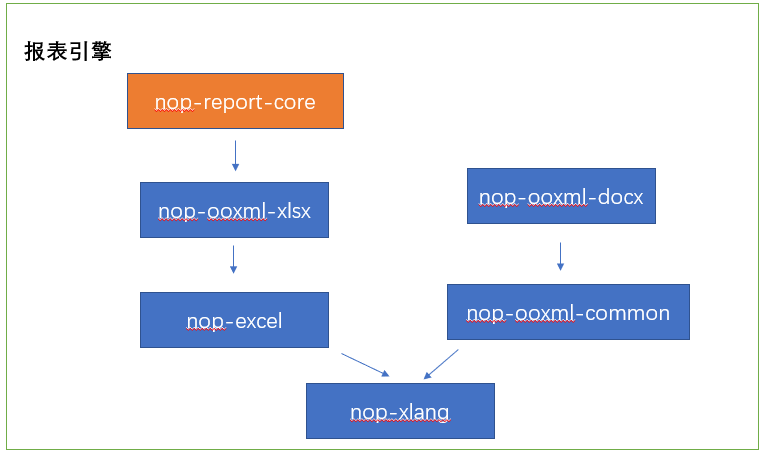
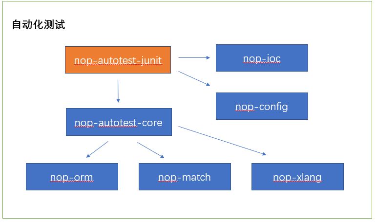
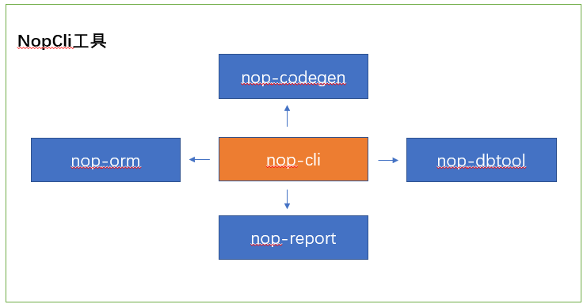

# Module Dependencies

While the Nop platform may have many modules, it uses dependency injection and dynamic loading, resulting in low coupling between modules. Most modules can be used independently and integrated with other frameworks.

## Core Modules

The core modules of the Nop platform are **nop-core** and **nop-xlang**, which contain the concrete implementations of the specific reversible computation principles.

* **nop-api-core** contains all the shared global objects and interaction messages needed within or outside the platform. For example, it includes all annotations used by the platform, common API request and response beans (e.g., ApiRequest, ApiResponse, PageBean), unified exception handling (NopException), the IContext global context, and IUserContext user context. When third-party frameworks need to call Nop platform service interfaces, they typically reference this module.

* **nop-commons** provides utility classes like StringHelper and FileHelper, along with many business-agnostic data structures encapsulated (e.g., ThreadPoolExecutor, LocalCache, TextScanner).

* **nop-core** is responsible for providing core model objects that other modules might use, as well as global model caching and dependency tracking mechanisms. This includes basic structures and algorithms (e.g., Tree, Table, Graph, Filter, FieldSelection), XML/JSON parsing (without relying on third-party libraries), a differential virtual file system, a global model loader, dictionary tables, internationalization messages, and exception code mappings. For GraalVM support, this module also provides custom generic type definitions and reflection-based mechanisms.

* **nop-xlang** contains the Nop platform's core XLang language and the implementation of the differential merging algorithm. XLang is a unified term for the various domain-specific languages ( DSLs ) built into the Nop platform, such as XDef (for defining models), XMeta (for defining object structures), Xpl (for meta-programming), XScript (for macro functions), XPath (for path queries), and XTransform (for structure transformations). See [XLang](https://gitee.com/canonical-entropy/nop-entropy/blob/master/docs/dev-guide/xlang/index.md).

* **nop-codegen** provides a code generator that can be integrated with Maven build tools. The built-in meta-programming mechanism in XLang can be viewed as a language-native code generator, while the external codegen is a data-driven differential code generator. See [CodeGen](https://gitee.com/canonical-entropy/nop-entropy/blob/master/docs/dev-guide/codegen.md).

* **nop-codegen**'s templates directory contains many built-in code generation templates, such as `/templates/orm` for generating complete front-end and back-end operations based on data models. These code generation templates may require parsing DSL models, which in turn requires importing the corresponding meta-model and Excel model analysis. For example, to parse G4 files and generate Antlr AST parsers, the `nop-antlr4` dependency is required. See [ANTLR](https://gitee.com/canonical-entropy/nop-entropy/blob/master/docs/dev-guide/xlang/antlr.md).

To analyze Excel data models, we need to import `nop-orm-model` and use `nop-xdefs` from the `nop-xdefs` module.

The development of Nop-xlang is a self-contained process. Since codegen requires Xpl and XScript languages, and XScript's parser is generated using Antlr, the development follows these steps:

1. Manually write a simple XScript parser to support Antlr-generated code templates.
2. Generate XScript parsers based on Antlr models.
3. Replace manually written parsers with those generated by Antlr.

The Nop-codegen tool can be used independently of the Nop platform for generating code for other frameworks or languages, such as MyBatis or Vue. It can also combine CodeGenerator with FileWatcher to automatically regenerate dependent files when directory contents change.

After importing `nop-xlang`, you can call `ResourceComponentManager.instance().loadComponentModel(path)` to load from `src/resources/_vfs/`.

 
 Within the directory's virtual file system, model files are automatically parsed based on xdef meta-model definitions. This includes Delta differencing, code generation during compilation, and various model transformation operations, all of which are cached for efficiency.
 

## GraphQL Engine

The backend services of the Nop platform utilize the NopGraphQL engine for GraphQL implementation. Unlike the graphql-java package, NopGraphQL is a completely new implementation from scratch. It leverages reversible computation principles to maximize code reduction, thereby improving runtime performance. The engine supports dynamic model loading and integrates both REST and GraphQL interface types.

* **nop-graphql-core** provides the execution engine for GraphQL queries, coordinating multiple DataFetchers for parallel data retrieval and wrapping RPC interfaces.
* **nop-graphql-orm** handles various DataFetcher implementations using the NopORM engine.
* **nop-dao** offers JDBC encapsulation, transaction handling, and database dialect mechanisms.
* **nop-orm-model** defines entity models, while **nop-orm-eql** provides EQL query parsing. These modules can be used independently of the NopORM engine.
* **nop-orm** implements an ORM engine that incorporates all core functionalities of Hibernate and MyBatis.
* **nop-biz** contains the [BizObjectManager](https://gitee.com/canonical-entropy/nop-entropy/blob/master/nop-biz/src/main/java/io/nop/biz/impl/BizObjectManager.java) which implements [IGraphQLSchemaLoader](https://gitee.com/canonical-entropy/nop-entropy/blob/master/nop-graphql/nop-graphql-core/src/main/java/io/nop/graphql/core/schema/IGraphQLSchemaLoader.java). This process maps GraphQL requests to BizModel methods, similar to how REST frameworks map URLs to Controller classes. For detailed implementation specifics, refer to [GraphQL-java documentation](https://gitee.com/canonical-entropy/nop-entropy/blob/master/docs/dev-guide/graphql/graphql-java.md).
* **nop-biz** also includes CRUD and dictionary services, as demonstrated in [CrudBizModel.java](https://gitee.com/canonical-entropy/nop-entropy/blob/master/nop-biz/src/main/java/io/nop/biz/crud/CrudBizModel.java) and [DictProviderBizModel.java](https://gitee.com/canonical-entropy/nop-entropy/blob/master/nop-biz/src/main/java/io/nop/biz/dict/DictProviderBizModel.java).
* **nop-biz** employs finite-state machines via the **nop-fsm** module to model certain business workflows.
* **nop-biz** does not heavily rely on NopIoC, but it can utilize **nop-ioc** for bean configurations through **beans.xml**.

## Distributed RPC Framework

Building upon the GraphQL engine, the Nop platform establishes a distributed RPC mechanism. For implementation details, refer to [RPC Design Guide](https://gitee.com/canonical-entropy/nop-entropy/blob/master/docs/dev-guide/microservice/rpc-design.md).
 
* **nop-cluster-core** supports cluster-related functionalities such as load balancing, service discovery, and leader election.
* **nop-rpc-http** encapsulates the [IHttpClient](https://gitee.com/canonical-entropy/nop-entropy/blob/master/nop-http/nop-http-api/src/main/java/io/nop/http/api/client/IHttpClient.java) interface into the IRpcService (RPC service internal implementation interface).
* **nop-rpc-cluster** provides both broadcast-style and load-balanced RPC calls.
* **nop-ioC** incorporates autoconfiguration mechanisms similar to Spring Boot's **@autoconfig**, requiring only the inclusion of modules like **nop-cluster-nacos** for automatic initialization.

The Nop platform leverages Alibaba's Nacos service registry for automated service discovery. This is achieved through the **nop-cluster-nacos** module, which provides bean initialization and registration automation.

 
 * nop-cluster-sentinel is based on Alibaba Sentinel service for circuit breaker and rate limiting mechanisms
 
* nop-config provides dynamic configuration update functionality
 
* nop-biz implements RPC service interfaces using GraphQL engines
 
 
## Four. Application Entry
 

 
* The NopApplication class in the nop-boot module is analogous to the SpringApplication class in Spring Boot, responsible for creating and initializing the entire application.
 
* The nop-quarkus-web-starter module functions similarly to starter modules in Spring Boot, enabling integration of the Nop platform with the Quarkus framework by simply including the nop-quarks-web-starter module.
 
* The nop-spring-web-starter integrates the Nop platform with the Spring framework.
 
## Five. Application Modules
 

 
* The nop-web-site contains the front-end framework code for the Nop platform, which is the result of packaging the nop-chaos project.
 
* The nop-web-amis-editor includes the AMIS visualization designer's code.
 
Generally, the code generated from Excel data models is divided into several sub-modules: dao (data access object) provides entity definitions and mapper definitions; service provides GraphQL services; web provides front-end View models and AMIS page definitions. Common business applications typically include the nop-sys-web and nop-auth-web modules.
 
* The nop-sys module provides system dictionaries, sequence numbers, and other system-related backend services and front-end pages.
 
* The nop-auth module provides user role permission control-related backend services and front-end pages.
 
The overall design of the Nop platform uses a flexible modular structure. Initially, for each Excel data model, an app module is generated that references the corresponding service and web sub-modules, such as how nop-auth-app references nop-auth-web and nop-auth-service. During development and debugging, the nop-auth-app module can be used as a microservice to start independently via its built-in SSO mechanism.
 
Additionally, **all sub-modules' web and service components can be referenced within a single application to form a monolithic application**, such as in the approach taken by the nop-quarkus-demo module.
 
## Six. Report Engine
 

 
The NopReport is an engine designed to support Chinese-style report generation using Excel as the visual designer. The usage method can be found in [report.md](../user-guide/report.md).
 
* The nop-report-core module implements core mechanisms such as report expansion algorithms, expression evaluation, and function execution.
 
* The nop-ooxml-xlsx module provides functionality for parsing and saving Excel files without relying on Apache POI or other third-party libraries, using a lightweight XML parser to process Excel raw files.
 
* The nop-excel module offers the ExcelWorkbook model object, enabling automatic translation between XML formats and ExcelWorkbook objects via the workbook.xdef metadata model. This allows the ExcelWorkbook to exist independently of Excel software as a domain model.
 
* The nop-ooxml-docx module includes functionality for visually editing Word templates, with specific implementation details available in [word-temlate.md](../dev-guide/report/word-template.md).
 
## Seven. Automation Testing Framework
 

 
The Nop platform's automation testing framework is designed to be generic and independent of the JUnit framework.
 
* The nop-autotest-core module provides framework-agnostic test support, which integrates seamlessly with the nop-orm engine. It can automatically record data read from and modified by the ORM engine, initialize a database using recorded data, and validate test execution results against recorded outcomes.
 
* The nop-match module leverages prefix-based guiding syntax for result matching and validation algorithms.
 
* The nop-autotest-junit module provides JUnit framework integration through appropriate encapsulation, alongside integration with nop-ioc and nop-config modules to simplify test configuration and usage.
 
## Eight. IDEA Plugin
 

 
* The nop-idea-plugin is designed based on xdef metadata models to provide unified DSL suggestion, validation, hyperlink navigation, and debugging capabilities across various IDE features.
 
* The nop-xlang-debugger plugin supports breakpoint debugging with a socket-based interface for remote control of the Nop platform's debug process.
 
 * The being debugged application also needs to include the nop-xlang-debugger module. Because the basic principle of debugging is that when the application starts, it opens a socket listening port, and then the IDEA debugger connects to this port to send debug commands.

## Command Line Tools

The nop-cli command line tool aggregates several functionalities that can be used independently. For detailed information, please refer to [cli.md](../dev-guide/cli.md).

* The gen command requires the nop-codegen module to generate code.
* The reverse-db command requires the nop-dbtool module to perform reverse engineering of the database schema and then convert it into the defined entity models in the nop-orm module. Finally, use the report functionality provided by the nop-report module to export the entity models and save them into an Excel file.
