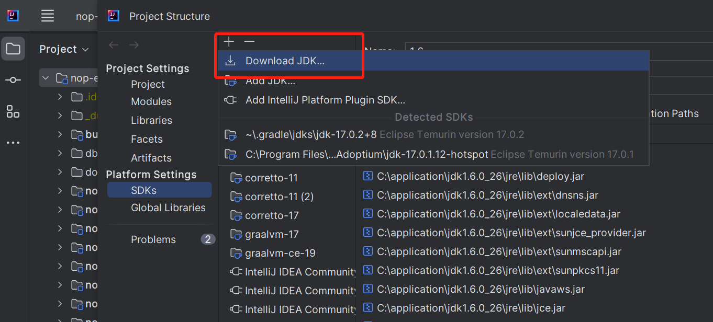
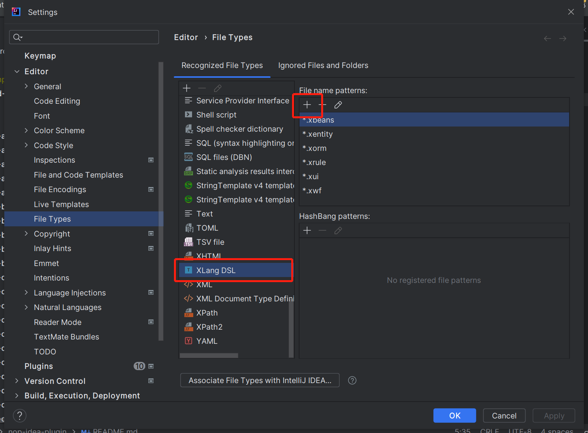

# Install JDK

To compile `nop-chaos`, you need JDK 11 or higher. You can download the latest IDEA development tool here: [Download](https://www.jetbrains.com/idea/download/#section=windows).

You can also select the specific JDK version by going to the menu **File > Project Structure > SDKS > Download SDK**.



## Compile Plugin

```bash
cd nop-idea-plugin
gradlew buildPlugin
```

The compiled plugin will be stored in the `build/distributions` directory.

## Install Plugin

After compiling the `nop-idea-plugin`, you can install it by going to the menu **File > Settings > Plugins > Install Plugins From Disk**.


## Identify File Types

To activate the `nop-idea-plugin`, the file type must be set to XLang DSL. You can add a file pattern in the menu **File > Settings > Editor > File Types** for XLang DSL.



## Clear Cache

If IDEA is unexpectedly closed during use, it may cause file indexing issues, leading to the plugin not functioning properly. You can clear the cache by going to the menu **File > Invalidate Caches**.


---

## Updating IDEA

After updating IDEA, you may encounter an error: "Plugin 'Nop Entropy' (version '*') is not compatible with the current version of the IDE, because it requires build '*' or older, but the current build is '*'."

This happens because the plugin's version number does not match the current IDEA version. To fix this, modify the `build.gradle.kts` file to set the plugin's version to the current IDEA version and rebuild.

```kotlin
patchPluginXml {
    sinceBuild.set("211")
    untilBuild.set("233.*")  // Update with current IDEA version
}
```
