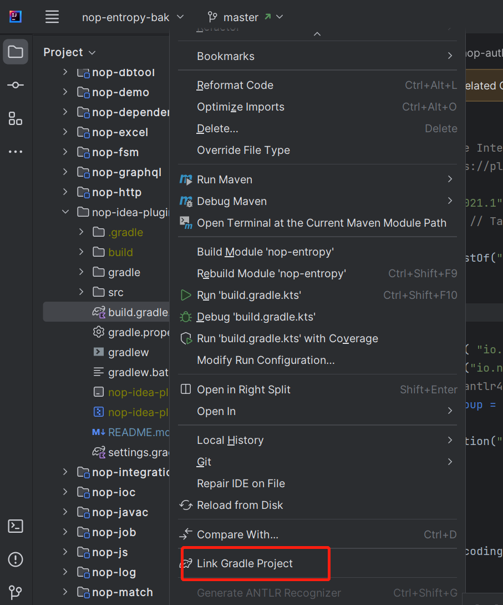
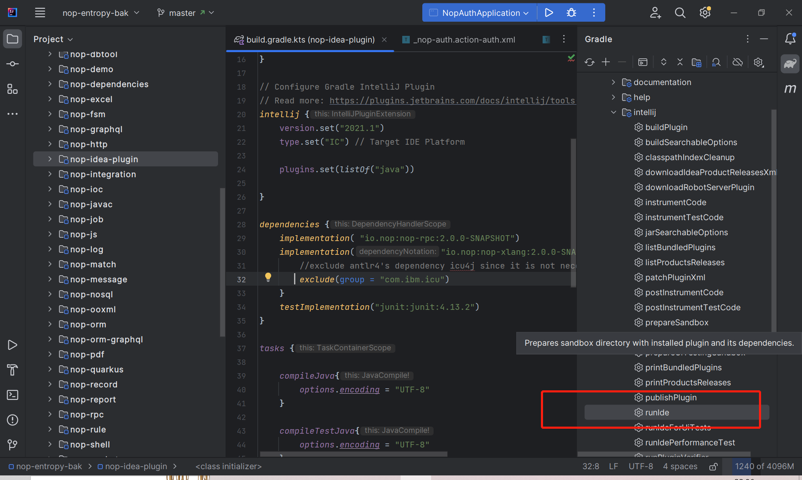

# Linking Gradle Project

The `nop-idea-plugin` project is a Gradle project within IDEA. You can right-click on the file `build.gradle.kts` and select the "Link Gradle Project" menu option.

## Debugging

After linking the Gradle project, you can debug it by selecting the appropriate tasks in the Gradle task manager. Right-click on the `Tasks > intellij > runIde` task and select the "Debug" plugin.
IDEA will then launch a new instance to perform debugging.

## Plugin Features

## Syntax Checking

The `XLangAnnotator` responsible for checking whether an XML file adheres to the `xdef` schema definition.

## Code Suggestions

The `XLangCompletionContributor` provides code suggestions based on the `xdef` schema definition, including labels, property names, and values.

## Quick Documentation

When you hover over labels, property names, or values in the schema, IDEA will display a pop-up with information from the `xdef` schema. This is implemented by the `XLangDocumentationProvider`.

## Linking

When you press `Ctrl +` while hovering over an element, IDEA will navigate to the corresponding linked location. The `XLangFileDeclarationHandler` identifies virtual file paths and XPL labels, then performs the navigation.

## Breakpoints

The `XLangDebugExecutor` adds breakpoints for debugging purposes. It is implemented by extending the `Debug/Run` level and adding a debug button.

The `XLangDebuggerRunner` initializes the debugger. It starts an RPC service within the target program, exposing the `io.nop.api.debugger.IDebugger` interface via remote calls.

## Virtual File System

In IDEA, the virtual file system is managed by the singleton `VirtualFileSystem`. The `ResourceComponentManager` also acts as a singleton to load and cache model files. Since multiple projects can be opened simultaneously, each project must have its own cache. Therefore, in the `NopAppListener`, we register custom implementations for `VirtualFileSystem`, `ResourceComponentManager`, and `DictProvider`. These are then used by the `ProjectEnv` class to access context-specific information.

The `ProjectEnv` retrieves the `Project` object from the context and uses the cached services (`NopProjectService`) to perform operations. This ensures that each project's cache is independent, maintaining performance and data integrity.

