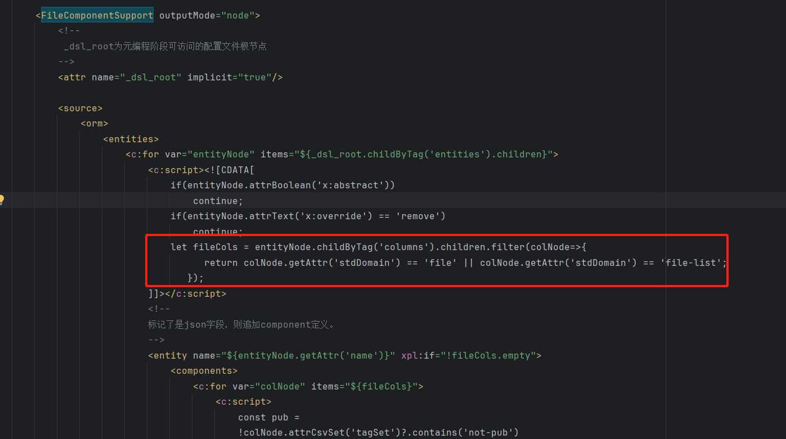

# Attachments and Attachment List Field

## Implementation Principle

1. In the `orm.xml` model, set the domain of the field to "file", i.e., `stdDomain="file"`
2. Add `<orm-gen:DefaultPostExtends/>` tag in the `x:post-extends` section of `orm.xml`
3. The DefaultPostExtends tag will call FileComponentSupport tag, which will iterate over all fields with `stdDomain="file"` and generate corresponding FileComponent fields.



```xml
<orm>
  <x:post-extends>
    <orm-gen:DefaultPostExtends xpl:lib="/nop/orm/xlib/orm-gen.xlib"/>
  </x:post-extends>

  <entities>
    <entity className="io.nop.auth.dao.entity.NopAuthUser" attrs="...">
      <columns>
        <column code="AVATAR" displayName="Avatar" domain="image" name="avatar"
                precision="100" propId="10" stdDataType="string" stdDomain="file"
                stdSqlType="VARCHAR" i18n-en:displayName="Avatar"
                ui:show="X"/>
      </columns>
    </entity>
  </entities>
</orm>
```

4. When `OrmSession.flush` is called, it will trigger the `onEntityFlush` method of all Component attributes for each entity. The `OrmFileComponent.onEntityFlush` method will link temporary files uploaded with the current entity. If an entity has already been linked to other files, it will automatically delete the previously uploaded file.
