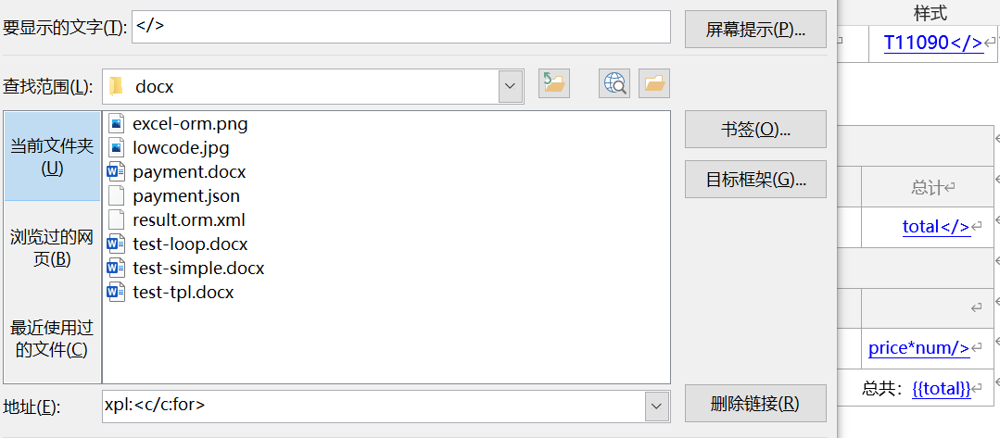

# 1. Adding Minimal Annotations to the Template

In a Word document, adding minimal annotations can convert it into an export template.

# 2. Adding Hyperlinks to Replaceable Text in the Template

## Example Image


The hyperlink text can be example content, such as "快递" (Courier).  
The URL format is `expr:EL expression`, used to indicate how data is retrieved, e.g., `expr:order.delivery`.

This element retains all style settings and inserts accurately in the document structure. Compared to directly inserting text into the document, using hyperlinks maintains the original structure better. This is especially useful when expressions are long; using example text avoids issues like table formatting or line breaks.

If the interface has sufficient display space, you can use hyperlink text as an expression. In such cases:
- The URL format is `expr:` or `xpl:`, depending on whether the expression content exists in the link address.
- For example, `${entity.consignee}` in the image.

> **Note:** Ensure that `${` characters are used correctly and not confused with Chinese characters.
If you need to output `${` in the final result, use the escaped version: `${'$'}{`.

## 3. Using Hyperlinks for Pairing


Using paired hyperlinks (`xpl:<c:for var="order" items="${entity.orders}">` and `xpl:</c:for>`) wraps content between `<c:for>` tags.

Compared to poi-tl, this approach is more flexible:
- It allows custom tags.
- Variables have clear scoping.
- No need for special syntax conventions.

## 4. Adding Hyperlinks to Replaceable Images


Using `expr:` can specify the image resource (`IResource` interface).  
Compared to poi-tl's direct embedding, this allows visual adjustments like size and display style.

## 5. Direct Embedding of EL Expressions
You can directly embed `${expr}` in Word text. However, due to font issues, a single expression may be split into multiple `<w:t>` tags, causing incorrect parsing.
In such cases:
- Select the expression text.
- Add a hyperlink with content set to `xpl:`.
- For example: `${entity.consignee}`.

> **Note:** Ensure that `${` characters are used correctly. If you need to output `${` in the final result, use the escaped version: `${'$'}{`.

## 6. Using XplGenConfig for Initialization


poi-tl is described as a "logic-less" template engine without complex control structures or variable assignment—only tags. While this simplifies implementation:
- It requires Java code for data preparation.
- The default rendering strategy is rigid.

If you need a Word template management platform, the template itself must have some logic independence. Many initializations and data preparations should be performed within the template, not relying on external code.

## 7. XplGenConfig Configuration


You can add an `XplGenConfig` table at the end of the template to configure:
- **dump**: Whether to convert the template into XPL code during compilation.
- **dumpFile**: When `dump=true`, specifies the output file for generated code. For example, if `dump=false`, the default is `docx-gen.xlib`.
- **importLibs**: Imports custom libraries (e.g., `xlib/docx-gen.xlib`).
- **beforeGen**: Initialization code executed before template generation.
- **afterGen**: Code executed after template generation.


The Word template will be converted into XPL templates and then compiled and output. The converted code can be viewed using the `dumpFile` function, which maintains a structure similar to the following:

```xml
<c:unit>
  <c:import from="/nop/test/orm-docx.xlib"/>
  <c:import from="/nop/ooxml/xlib/docx-gen.xlib"/>
  <c:out escape="none"><?xml version="1.0" encoding="UTF-8"?>
</c:out>
  <c:unit xpl:outputMode="none">
    <c:script>logInfo("test")</c:script>
  </c:unit>
  <w:document>
    ...
  </w:document>
</c:unit>
```

When the XPL template is compiled and an error is detected, an exception is thrown. This exception includes detailed error information and the exact line number. The line number corresponds to the `dumpFile` file location, as shown in the example:

```xml
io.nop.api.core.exceptions.NopEvalException:
NopEvalException[seq=1, errorCode=nop.err.commons.text.scan-unexpected-char,
params={pos=19, reader=${model.displayName}, expected=},
desc=The next character is not the expected character'}]
_loc=[68:35:0:0]file:/C:/can/entropy-cloud/nop-ooxml/nop-ooxml-docx/dump-tpl.doc.xml
  @@c:unit/w:document/w:body/w:p[2]/w:r/w:t@@[68:12:0:0]file:/C:/can/entropy-cloud/nop-ooxml/nop-ooxml-docx/dump-tpl.doc.xml
```

The error message indicates that a syntax error occurred at line 68, column 35 in `dump-tpl.doc.xml`. The error also displays the XLang language's stack trace instead of Java function stack trace. The corresponding code is:

```xml
<w:t>${model.displayName}</w:t>
```

Specific template examples and output results include:

- [payment.docx](https://gitee.com/canonical-entropy/nop-entropy/tree/master/nop-ooxml/nop-ooxml-docx/src/test/resources/payment.docx)
- [result-payment.docx](https://gitee.com/canonical-entropy/nop-entropy/tree/master/nop-ooxml/nop-ooxml-docx/src/test/resources/result-payment.docx)


## 7. Automatic Line Break Display

If the text contains a newline character, it should automatically wrap when outputting to Word. Use the `<docx-gen:r-br>` tag for this purpose.

The `<docx-gen:r-` prefix tag generates `<w:r>` text segments in Word. The `rPr` child node can be used to retrieve formatting settings from Word.


