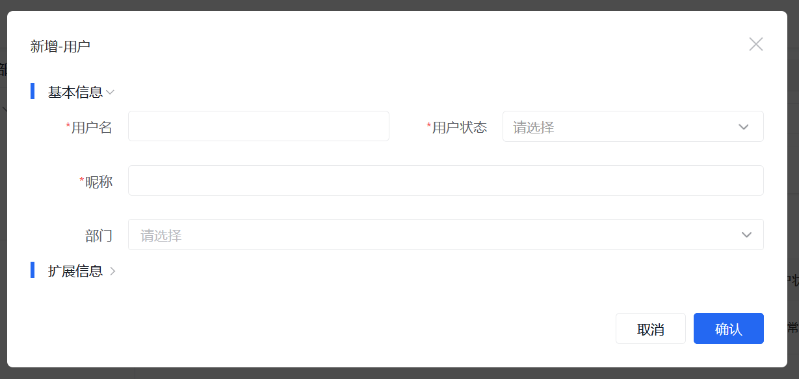
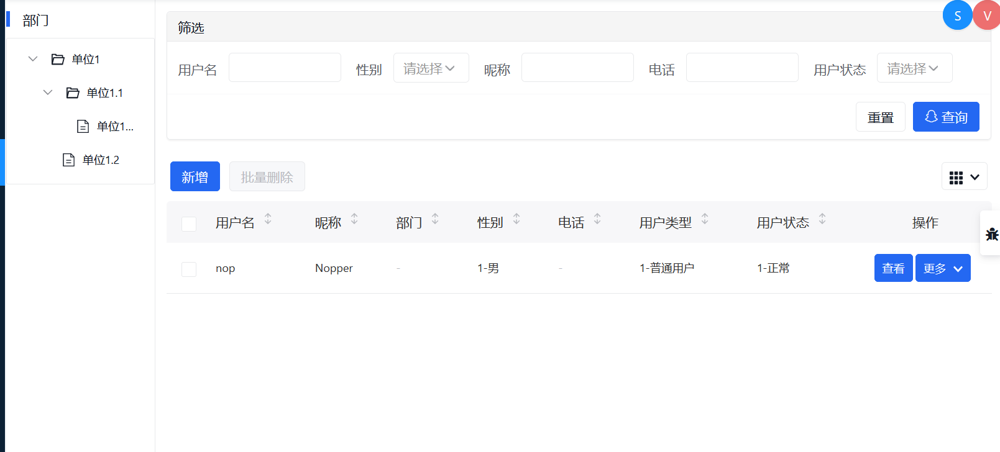

# Layout Language

In the Nop platform, we use NopLayout—a specialized language for form layouts—to separate layout information and (field-level) content information. For example, in the following form layout:

```xml
<form id="add" editMode="add" title="Add User" i18n-en:title="Add User">
  <layout>
    ============>baseInfo[Basic Information]=======
    userName[Username] status[Status]
    nickName[Nickname] deptId[Department]

    ===========^extInfo[Extended Information]=========
    idType[Document Type] idNbr[Document Number]
    birthday[Birthday] workNo[Employee Number]
    positionId[Position]
    remark[Remarks]
  </layout>
</form>
```

Layout Display



## 一. Layout Syntax

NopLayout defines the following rules:

1. Specify which fields to display per row, e.g., `a b` displays both `a` and `b` fields in a single row.

2. Use `fieldName[displayName]` to specify the field name along with its display name.

3. Use `===groupName[Group Label]===` to mark a group.

4. If a group has a Label, use the `FieldSet` control to display the group. The symbols `^` and `>` indicate group collapse and expansion, respectively.

5. Prefix a field with `@` to indicate it is a read-only field, which will be displayed using the view mode's controls.

6. Prefix a field with `!` to indicate that its Label should not be displayed.

For example, adding a filter form on the left side of the user list essentially introduces a filter form on the left:

```xml
<form id="asideFilter" submitOnChange="true" editMode="query">
  <layout>
    ==dept[Department]==
    !deptId
  </layout>
  <cells>
    <cell id="deptId">
      <gen-control>
        <input-tree
           source="@query:NopAuthDept__findList/value:id,label:deptName,
              children @TreeChildren(max:5)?filter_parentId=__null"/>
      </gen-control>
    </cell>
  </cells>
</form>
```

`deptId` field is prefixed with `!` to indicate that its Label should not be displayed.



## 二. Field Control Determination

Field-level controls are generally determined based on the data model defined in the application. For example, for the `gender` field, we use the dictionary `auth/gender`, limiting the values to those within the dictionary. Similarly, for the `email` field, the domain is set to `email`, requiring the input to conform to email format specifications.

When specific controls are required for a particular field's determination, the process begins by first determining the field's edit mode (usually matching the form's `editMode` setting but can be individually specified). Next, it searches through the `control.xlib` control library in the following order:

1. Look for a control with the name `{editMode}-{control}`, where `control` is explicitly defined in the cell configuration's `control` attribute.

2. Look for a control with the name `{editMode}-{domain}`, such as `<edit-email/>`.

3. If a dictionary entry exists, look for a control with the name `{editMode}-enum`.

4. Look for a control with the name `{editMode}-{stdDomain}`, where `stdDomain` is a globally registered standard domain equivalent to a basic data type, such as `stdDomain=xml` indicating a text field storing XML content.

5. If it's a foreign key relationship, look for a control with the name `{editMode}-to-one`.

6. Look for controls with names like `{editMode}-{dataType}`, such as `<edit-string/>` and `<edit-double/>`.

7. If `editMode` is neither `edit` nor `view`, start again from step 1 using `edit` mode.

8. If the mode is `view`, use `<view-any/>`. Otherwise, use `<edit-any/>`.

```markdown
## editMode modes

`editMode` consists of `add/view/update/edit/query` multiple modes, primarily used to distinguish between different usage scenarios for fields. Depending on the usage scenario, different controls may be used. For example, in editing mode, a single-select control may be used, while in query mode, a multi-select query control may be chosen. In form layout, the same field name can be used to represent the field.

## Field Control Assignment is an Extensible Mechanism

When we encounter repeated semantic meanings at the field level in our business, we can define a unique `domain` for them in the data model. This allows us to use a unified control for all fields marked with this `domain` in the frontend. The work involved is as follows:

1. Define `domain` in the data model and assign it to the field
2. Add different edit modes to `control.xlib` (e.g., `<edit-roleId/>`, `<view-roleId/>`, `<query-roleId/>`). Alternatively, instead of directly modifying `control.xlib`, we can use the Delta customization mechanism to extend the built-in `control.xlib`.

The process of handling user-defined `domain` is consistent with the built-in `domain` processing.

If a control is special and does not abstract the value of a unified `domain`, we can also choose to directly specify the display control used in the form, such as:

```xml
<form id="edit">
  <layout>
    ...
  </layout>
  <cells>
    <cell id="fldA">
      <gen-control>
        Here is the specific description of the control in use
      </gen-control>
    </cell>
  </cells>
</form>
```

`gen-control` is generated using the XPL template language to produce JSON control descriptions.

## Field Interactivity

In addition to layout information, interactivity between fields can be specified through additional `cell` configurations. For example:

```xml
<form id="default" >
  <layout>
    sid[Resource ID] siteId[Site ID]
    displayName[Display Name] orderNo[Sorting]
    resourceType[Resource Type] parentId[Parent Resource ID]
    =====menuProps=====
    icon[Icon] routePath[Front-end Routing]
    url[URL] component[Component Name]
    target[Link Target] hidden[Whether Hidden]
    keepAlive[保持状态时隐藏] noAuth[无权限检查]
    depends[依赖资源]
    =====authProps=====
    permissions[Permission Mark]
    =====otherProps=====
    status[状态] remark[备注]
  </layout>

  <cells>
    <cell id="parentId">
      <requiredOn>${resourceType != 'TOPM'}</requiredOn>
    </cell>
    <cell id="menuProps">
      <visibleOn>${resourceType != 'FNPT'}</visibleOn>
    </cell>
    <!--
     Field grouping without Label will only serve grouping purpose and not display as FieldSet
    -->
    <cell id="authProps">
      <visibleOn>${resourceType == 'FNPT'}</visibleOn>
    </cell>
  </cells>
</form>
```

`cell` can be used not only to specify a single field but also to correspond to field grouping, thereby setting display/hide conditions for a group of fields. For example, `menuProps` corresponds to a group of fields and will only be displayed when `resourceType != 'FNPT'`.

## Prototype Inheritance

In information systems, a common phenomenon is that forms have similar or identical layouts even when adding, modifying, or querying, but different controls are used for modification and querying. For such scenarios, standardization is difficult to achieve with general-purpose frameworks, but the Nop platform leverages reversible computation principles to provide a standardized solution:

1. **Abstract information into a DSL node**
2. **Use the built-in `x:prototype` mechanism in X language to construct the prototype**


## Customizing Templates with `x:prototype-override`


1. **Define Forms**: Extract the form layout by abstracting it into `<form/>` nodes.
   
   ```xml
   <form id="default" x:abstract="true">
     <layout>
       <!-- Layout configuration -->
     </layout>
     <cells>
       <!-- Cell definitions -->
     </cells>
   </form>
   ```

2. **Template Setup**:
   - Set `x:prototype` for the default view/edit forms to `"default"`。
   - Use `<cell/>` nodes for displaying specific fields.

3. **Cell Configuration**:
   
   ```xml
   <form id="view" x:prototype="default" editMode="view">
     <!-- View-specific layout -->
   </form>

   <form id="edit" x:prototype="default" editMode="edit">
     <!-- Edit-specific layout -->
   </form>
   ```


The `x:abstract` attribute is a special syntax in XLang. When set to `true`, it marks the node as a template, which will be automatically removed from the final output, similar to Spring's `abstract` property in XML configurations.

---


The NopLayout system supports complex layout structures through nested groups. Each group can be defined using `#` symbols, similar to Markdown:

```xml
<form id="default">
  <layout>
    ====#sub1===
    ========##sub1_1###
    a b
    ========##sub1_2###
    c d
    ====#/sub1===
  </layout>
</form>
```

Here, `###` denotes a primary group, and `##` indicates child groups under it. Each `#` increases the nesting level.

