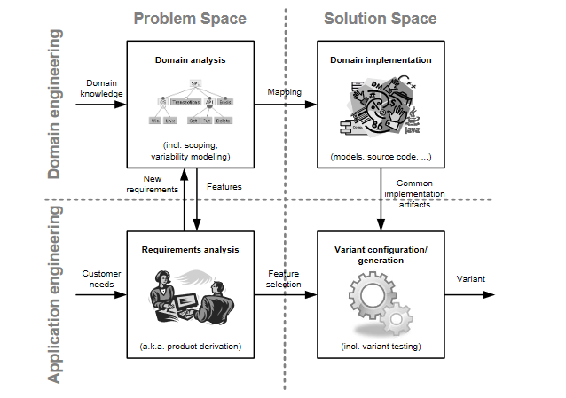
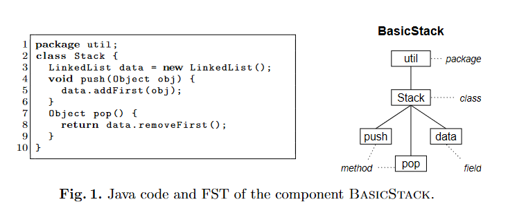
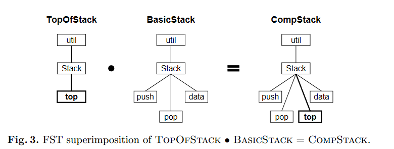
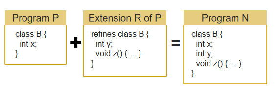
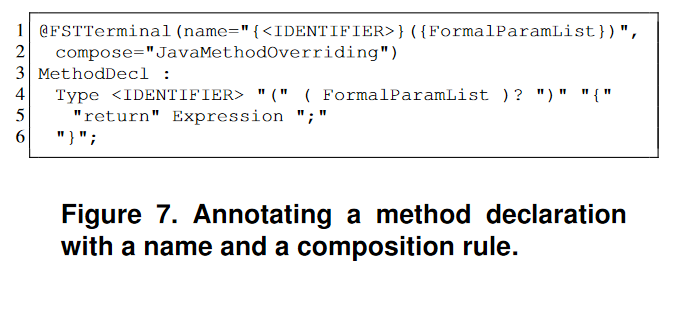
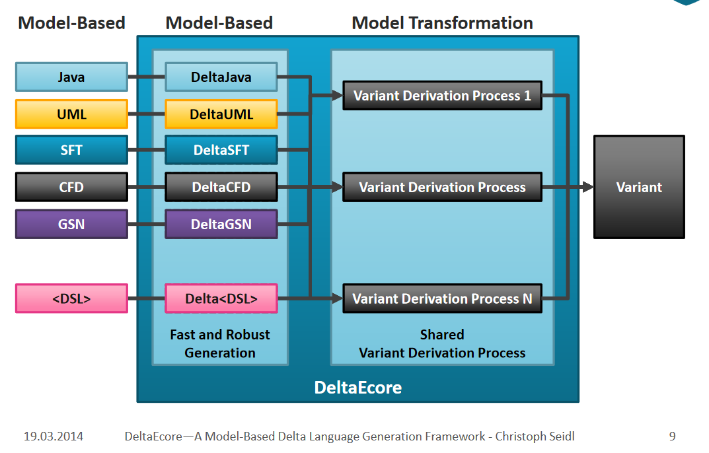

# From Reversible Computing to Delta-Oriented Programming

Several years ago, when reporting to my leaders about the originality and applicability of reversible computing theory, I conducted some literature research by reviewing past papers from the International Conference on Software Engineering (ICSE). The closest related theory found was Feature Oriented Programming (FOP) introduced in 1997 <sup>[\[2\]](#f2)</sup><sup>[\[3\]](#f3)</sup>, followed by Delta-Oriented Programming (DOP) proposed by German professor Schaefer around 2010 <sup>[\[7\]](#f7)</sup><sup>[\[8\]](#f8)</sup>. Reversible computing theory was introduced by me around 2007 <sup>[\[12\]](#f12)</sup><sup>[\[13\]](#f13)</sup><sup>[\[14\]](#f14)</sup>, and its conceptual roots are not in traditional software engineering or computer science but rather in theoretical physics. At the time, I was unaware of existing theoretical achievements in software engineering related to this theory from a foundational perspective. Therefore, reversible computing differs fundamentally from existing theories in the field.

In this paper, I will briefly discuss the differences and connections between reversible computing theory and similar theories.

---

## 1. Software Product Line Engineering and Variability Management

When discussing software engineering theories, it's impossible to avoid mentioning Carnegie Mellon University's Software Engineering Institute (SEI). While SEI is a leader in theoretical research, it is also a practical model that has achieved CMM certification <sup>[\[1\]](#f1)</sup>. Since the introduction of what is known as "software product line engineering" <sup>[\[1\]](#f1)</sup> by SEI, numerous theories in the field have undergone refinement. Software product line engineering is a comprehensive theory that spans both management and technical domains, aiming to utilize all feasible means to address the extremely large-scale and product-level reuse challenges <sup>[\[1\]](#f1)</sup>. This core technical issue proposed by software product line engineering—variability management—is almost like a universal problem. It encompasses nearly all difficulties encountered during the development and evolution of software, primarily due to insufficient capability to handle changes <sup>[\[1\]](#f1)</sup>.

FOP positions itself as a natural and efficient approach to implementing software product lines. DOP, introduced later by Schaefer, is considered an improvement over FOP and serves as a key methodology for managing variability <sup>[\[7\]](#f7)</sup><sup>[\[8\]](#f8)</sup>. From the same perspective, reversible computing was proposed even earlier, predating DOP. While both FOP and DOP are rooted in feature-based approaches, their underlying principles differ significantly from those of reversible computing.

The fundamental challenge of variability management lies in effectively controlling **unexpected** changes <sup>[\[1\]](#f1)</sup>. If we have a thorough understanding of a domain and its change patterns are limited to a small number of types, we can establish critical extension points <sup>[\[1\]](#f1)</sup> at strategic locations. However, if the potential for changes continues to expand, encompassing increasingly diverse forms, this becomes an insurmountable challenge even with meticulous planning.

In physics, this is a problem that has long been solved.

---

## 2. From Feature-Oriented Programming (FOP) to Delta-Oriented Programming (DOP)

Feature-Oriented Programming (FOP), as its name suggests, focuses on features <sup>[\[3\]](#f3)</sup>. According to the definition in literature <sup>[\[3\]](#f3)</sup>, a feature is essentially a reusable module of functionality. Features were first introduced by Schaefer around 1997 <sup>[\[2\]](#f2)</sup><sup>[\[3\]](#f3)</sup>. DOP, proposed slightly later by the same researcher, represents an evolution in this concept, addressing some of the limitations of FOP <sup>[\[7\]](#f7)</sup><sup>[\[8\]](#f8)</sup>.

From a technical perspective, features are reusable units that can be dynamically selected at runtime. The core idea behind FOP is to modularize functionality into features, enabling easier management and reuse of code across different products. DOP extends this concept by introducing deltas, which represent changes between versions of software components <sup>[\[7\]](#f7)</sup><sup>[\[8\]](#f8)</sup>. This approach allows for more precise control over functionality and facilitates better management of variability.

Reversible computing, on the other hand, operates on a fundamentally different paradigm. Instead of focusing on feature-based modularization or delta-based evolution, it emphasizes the inversion of functions and the preservation of states <sup>[\[12\]](#f12)</sup><sup>[\[13\]](#f13)</sup><sup>[\[14\]](#f14)</sup>. The theoretical foundation of reversible computing is rooted in concepts from theoretical physics, particularly in areas like quantum mechanics and information theory.

---

## 3. Reversible Computing and Delta-Oriented Programming

Reversible computing was first introduced by me around 2007 <sup>[\[12\]](#f12)</sup><sup>[\[13\]](#f13)</sup><sup>[\[14\]](#f14)</sup>, drawing inspiration from principles in theoretical physics rather than traditional software engineering or computer science. At the time, I was unaware of any existing theories within the software engineering community that aligned with this approach from a foundational standpoint.

The key challenge of variability management lies in effectively controlling **unexpected** changes <sup>[\[1\]](#f1)</sup>. If we have a thorough understanding of a domain and its change patterns are limited to a small number of types, we can establish critical extension points <sup>[\[1\]](#f1)</sup> at strategic locations. However, if the potential for changes continues to expand, encompassing increasingly diverse forms, this becomes an insurmountable challenge even with meticulous planning.

In physics, this is a problem that has long been solved.

---

## 4. From Feature-Oriented Programming (FOP) to Delta-Oriented Programming (DOP)

Feature-Oriented Programming (FOP), as its name suggests, focuses on features <sup>[\[3\]](#f3)</sup>. According to the definition in literature <sup>[\[3\]](#f3)</sup>, a feature is essentially a reusable module of functionality. Features were first introduced by Schaefer around 1997 <sup>[\[2\]](#f2)</sup><sup>[\[3\]](#f3)</sup>. DOP, proposed slightly later by the same researcher, represents an evolution in this concept, addressing some of the limitations of FOP <sup>[\[7\]](#f7)</sup><sup>[\[8\]](#f8)</sup>.

From a technical perspective, features are reusable units that can be dynamically selected at runtime. The core idea behind FOP is to modularize functionality into features, enabling easier management and reuse of code across different products. DOP extends this concept by introducing deltas, which represent changes between versions of software components <sup>[\[7\]](#f7)</sup><sup>[\[8\]](#f8)</sup>. This approach allows for more precise control over functionality and facilitates better management of variability.

Reversible computing, on the other hand, operates on a fundamentally different paradigm. Instead of focusing on feature-based modularization or delta-based evolution, it emphasizes the inversion of functions and the preservation of states <sup>[\[12\]](#f12)</sup><sup>[\[13\]](#f13)</sup><sup>[\[14\]](#f14)</sup>. The theoretical foundation of reversible computing is rooted in concepts from theoretical physics, particularly in areas like quantum mechanics and information theory.

---

## 5. Reversible Computing and Delta-Oriented Programming

Reversible computing was first introduced by me around 2007 <sup>[\[12\]](#f12)</sup><sup>[\[13\]](#f13)</sup><sup>[\[14\]](#f14)</sup>, drawing inspiration from principles in theoretical physics rather than traditional software engineering or computer science. At the time, I was unaware of any existing theories within the software engineering community that aligned with this approach from a foundational standpoint.

---


Here is the translated English version of the provided Chinese technical document, preserving the original Markdown format including headers, lists, and code blocks:

---

### A Feature
A feature is a unit of functionality within a software system that satisfies a requirement, represents a design decision, and provides a potential configuration option.


#### Example:
According to the above feature model, a car (Car) must have an engine (Engine) as a feature. The engine can be either gasoline or electric, and even hybrid. However, the transmission (Transmission) can only be automatic or manual, but not both simultaneously. In software product line engineering, software development is similar to configuring a car. After selecting specific features, a generator converts them into executable code and automatically generates runnable software.



---

### FOP's Basic Insight
FOP's fundamental insight lies in **features** (what we focus on at the business level). These often cannot be well-aligned with either object-oriented components or function decomposition. As a result, they almost inevitably become crosscutting concerns. This is actually quite understandable. Features represent valuable, identifiable structures within the problem space, while components/functions represent valid abstract and descriptive structures within the solution space. The structure mapping from problem space to solution space in general business environments is always **non-trivial**, making the two representation styles unable to align effectively. Using AI-related terminology, we can say: **useful features are all distributed (distributed)**.

In software product line engineering, a basic technical approach for implementing feature definitions and combinations is similar to C-style preprocessing.


---

### Contribution of FOP
FOP's contribution to software product line engineering lies in providing more standardized and powerful mechanisms for feature definition and combination. This is supported by references [5] and [6].

1. Define a language-independent feature structure tree (Feature Structure Tree, FST).
2. Use language-independent Tree Superimposition (Tree Superimposition) for feature composition.

FST is simply a generic tree structure where each node has a name and type. Sub-nodes have distinct names, allowing them to be distinguished. Tree Superimposition refers to the process of merging two trees by sequentially merging nodes based on their names. The type matching of merged nodes' types must also occur during this process.





---

### Early FOP
In the early days, FOP did not realize the generality of tree structures or tree merging algorithms. It relied on syntactic extensions of existing languages for parsing.



---

### Apel's Contributions
Apel's work from 2008-2009 (references [4], [5], and [6]) advanced FOP to a new abstract level. It went beyond just code files, documents, and test cases. All related artifacts, including feature structure trees, can be included within the governance scope of FeatureHouse. FeatureHouse extends EBNF syntax rules by introducing FOP-related annotations, allowing for generic merging rules to be applied to any syntactic structure without requiring specific programming languages for FOP. This greatly expanded FOP's applicability.

---

### FEATUREHOUSE
FEATUREHOUSE relies on three ingredients:

1. A language-independent model of software artifacts.
2. Superimposition as a language-independent composition paradigm.
3. An artifact language specification based on attribute grammars.



---

# Understanding FOP and Its Practices

According to the previous section's analysis, FOP's practices are quite straightforward. An FST tree is simply a generic coordinate system where all **artifact** instances can be uniquely decomposed into this coordinate system, ensuring a unique and deterministic representation. This structure is a tree because any node to the root has a unique path, making it suitable for use as a coordinate.

Once the coordinate is established, the merging process becomes completely Generic, unrelated to specific business logic or structure. This point is clearly expressed in the **Feature Algebra** formalism introduced by Apel [4].


# Comparing AOP and FOP

When comparing AOP with FOP, an interesting situation arises. While AOP's **pointcut** mechanism is very powerful, using complex operators like regular expressions for filtering and selection can lose the uniqueness of coordinates, making it difficult to establish a Feature Algebra. Additionally, AOP is deeply bound to programming languages, making it difficult to extend to other **artifact** layers. Therefore, while AOP's expressive power is significant, it is not everything we need. Reverse computation emphasizes reversibility, and behaviors that break reversibility are often restricted or even prohibited.

FOP's theory appears well-established, but from a reverse computation perspective, there is still vast room for development. In 2010, Schaefer identified a limitation in FOP and proposed **Delta Oriented Programming** [10].

# DeltaJ Introduction

If we discard all business interpretations of features and define the delta (Δ) as the difference between versions, we can immediately see that FOP only includes cover and add operations, not delete operations. DOP initially introduced the Java syntax: **DeltaJ** [10].


# DeltaEcore Introduction

Later, DOP evolved to include **FeatureHouse**, introducing **DeltaEcore** [11].



# Core Product and Delta Module

Initially, DOP required a core product (CP), with all deltas acting on CP to produce the final product. However, according to reverse computation theory, in the presence of a unit element (U), delta and full operations can be interconverted. Schaefer quickly identified this and published a paper [8], stating that the core product is unnecessary if we rely solely on the **Delta Module**.

# XVCL vs Frame Technology

From a reverse computation perspective, examining DOP reveals significant development potential. The most obvious gap is the lack of a **Generator** component. However, compared to reverse computation, DOP's understanding of delta remains at an elementary level. Recently, taowen mentioned a paper [15] discussing **XVCL**, a technique related to deltas, which shares some similarities with DOP.

# XVCL and Frame Technology

XVCL claims its foundation lies in **Frame Technology**, which originated from the field of artificial intelligence via Minsky's 1975 work. From a basic understanding, **Frame** is a structural template (architype) that digs into certain aspects, referred to as slots, which can be customized. Essentially, **XVCL** and **Frame Technology** are similar, with **XVCL** being more lightweight.

# Example Analysis

1. Choose an example X
2. Highlight the details of X's internal changes, translating these into **frame parameters** (slots), while treating X's original content as default values (slot's body). This is akin to a Vue component.

In 2008, Bassett discussed **Frame Technology** in an interview [17], highlighting interesting points rooted in reverse computation theory. These include:

1. Frames can effectively describe "A is similar to B, except for..." scenarios.
2. Adding a "+C" to B makes it similar to A + C.

### 2. The Burden of Copy-Paste Coding
In the realm of software development, programmers often resort to copy-pasting code, which not only consumes man-hours but also leads to inefficiencies and potential errors. By utilizing Frame commands for adding, deleting, or modifying code snippets, developers can achieve rapid yet reliable changes.
3. Structure Through Framing
The **Frame** system allows for nested structures called **Frame Trees**, which can be applied to any programming language's constructs (e.g., text within a natural language document). Adding **Frame** tags enables document expansion and modularization without altering the original codebase.

4. Single-Point Modifications
From the **Frame** perspective, maintenance is no longer a process of splitting development from deployment. Both processes are managed externally by incrementally applying **Frame** deltas (differences). This approach avoids modifying the original **Frame** system while allowing for precise updates.
5. Differential Analysis in Software Development
Similar programs often differ by small amounts of code. These differences can be isolated within a **Frame Delta**, which represents changes at the function, class, or module level. For instance, 95% - 15% of code modifications fall into this category.

6. Graininess in Implementation
Every domain has its "natural graininess." For example, adding hundreds or thousands of small classes and functions to a system can fragment its structure, leading to unnecessary complexity.
7. Inheritance Management with Semi-Lattices
The **Frame** system is built on semi-lattice mathematics. It effectively handles multiple inheritance challenges, similar to Scala's trait mechanism, by defining a coverage order to prevent conflicts during inheritance.

8. Archetype of Abstraction
A **Frame** can be considered as an archetype of abstraction, functioning like a fuzzy set's center element. Unlike other abstract technologies, it doesn't require perfection in initial implementations but allows for incremental enhancements through added tags (e.g., **slot** tags), which remain compatible with existing code and incur no runtime overhead.

The concept may sound revolutionary, yet the corresponding XVCL implementation remains straightforward and robust.


### Structure of XVCL
XVCL resembles a template language, enabling definitions for variables, conditions, and loops. The **adapt** directive allows nested function calls to other **Frame** modules. **Break** tags are used to denote extension points, analogous to Vue's **slot** directives. Due to its template-based nature, XVCL can generate both code and documentation from a single source.


### The Difference Between C Preprocessors and XVCL
While preprocessor tools like C's may offer some templating capabilities, XVCL represents a more advanced evolution. It supports arbitrary text files (not limited to specific programming languages) and provides stricter variable scoping along with a controlled delta mechanism—capabilities not available in traditional preprocessors.


### Beyond Traditional Preprocessing
XVCL stands out not only for its ability to manipulate text but also because it builds upon the semi-lattice mathematical framework. Unlike traditional tools, it does not rely on complex macro systems and offers precise control over changes through its delta mechanism.

However, from a theoretical standpoint based on reversible computation frameworks, XVCL's underlying coordinate system is fundamentally weaker than that of FeatureHouse [\[6\]](#f6). XVCL decomposes the system into individual **Frame** components and defines break points at each level. In contrast, FeatureHouse manages artifacts via a hierarchical structure resembling class-member relationships. While XVCL excels in modularizing and customizing, it struggles with complex dependencies compared to tools like DOP, which offer greater feature combination capabilities.

Despite these differences, both FOP, DOP, and Frame Technology leverage delta-based approaches. However, their implementation of deltas differs significantly from those in reversible computation theory:
- Traditional deltas represent changes as difference blocks.
- Reversible computation frameworks highlight the semantic meaning of deltas, emphasizing that deltas are not merely about what has changed but also about maintaining an inverse operation's capability.

The implications of this distinction will be explored in detail in the next section.

## 4. The Nature of Reversible Computation
In the introductory article [\[18\]](#f18), I presented a conceptual overview: reversible computation can be viewed as a third logic pathway alongside Turing machines and Lambda calculus. This perspective emphasizes that reversible computing goes beyond mere programming techniques or domain-specific patterns—it represents a fundamentally different approach to computation, one that is not merely a clever trick but a deeply recursive rethink of the computational paradigm.

The key point here is that **reversible computation is not merely a programmatic technique or a pattern applicable to specific domains**. It represents a structurally different way of approaching computation—one that involves creating computation structures (like **Frame**) capable of maintaining the necessary inverse operations for every forward step. This fundamentally changes how we view and design computational systems, as it implies a level of abstraction and structure that spans across all levels of system design.

The relationship between entropy and reversible computing is not limited to information theory. It extends into software development practices, where reversible computation suggests a way to manage the evolution of software systems while maintaining an exact understanding of how any change can be undone. This idea goes beyond traditional software versioning, which merely tracks changes but doesn't provide a clear path for rollback.

In summary:
- Traditional programming techniques often result in software that is "full of holes" and difficult to maintain.
- Reversible computation provides a mathematical foundation for building systems with intrinsic qualities of reversibility.

This approach aligns with the principles outlined earlier, where **Frame** systems enable precise control over changes through incremental deltas. However, it goes further by ensuring that every change can be reversed without ambiguity.

---

## Reversible Computation: Key Concepts and Implementation

### 1. Introduction to Reversible Computation
Reversible computation introduces the concept of **deltas** as a core mechanism. The total is defined as:
```
total = unit + delta
```
This implies that **total and delta are interchangeable**. A fundamental conclusion is that:
```
total and delta can be isomorphic
```
This approach differs significantly from practices in DOP and XVCL, where deltas are represented as actions:
```
delta = modify action
```
In contrast, the representation of delta in reversible computation is fundamentally different.

### 2. Handling Extensions in XVCL
In XVCL, extensions are marked using `break` tags within code. However, the universality of reversible computation leads to the following realization:
```
DSL models are defined within the coordinate system and form the coordinate system itself
```
No additional metadata needs to be added to the model for extension purposes. Instead, a similar approach to FeatureHouse can be adopted, adding minimal annotations in EBNF rules/schema definitions.

### 3. Challenges in FOP
In FOP, the Feature Structure Tree (FST) represents a high-level abstraction that has degenerated into a decision tree. Complex domain logic is difficult to embed due to the low-level nature of most programming language syntaxes, often forcing developers to rely on generic domain-specific constructs like Java.

### 4. Integration of DSLs
1. **Integration of DSLs**: DSLs can be seamlessly integrated using:
```
DSL_2 = Generator<DSL_1> + Delta
```
This allows shared information to flow bi-directionally between DSL models.
2. **Avoiding Logic Conflicts**: The integration process ensures that:
```
DSL_2 = Generator<DSL_1> + Delta
```
Maintains the integrity of both DSL models and their respective deltas.

### 5. Limitations in FOP
FOP's Feature Structure Tree introduces a hierarchical structure similar to package-class-method, which limits its ability to handle specialized domain-specific requirements. This hierarchy often leads to unnecessary type definitions and can trap developers in logical pitfalls characteristic of traditional programming paradigms.

### 6. Advantages of Reversible Computation
Reversible computation provides a unique coordinate system where:
```
delta is inherently valuable and does not depend on base for interpretation
```
This allows for more flexible and intuitive domain-specific modeling, avoiding the rigid structure often associated with conventional approaches like DOP and XVCL.

### 7. Code Structure in FOP
FOP's code structure mirrors its hierarchical nature:
```
FeatureStructureTree
├── Feature1
│   ├── SubFeature1a
│   │   └── Property1
│   └── SubFeature1b
└── Feature2
    ├── SubFeature2a
    │   └── Property2
    └── SubFeature2b
```
This structure forces developers to deal with properties and sub-features at each level, often complicating the management of domain-specific knowledge.

### 8. Final Thoughts on FOP vs. Reversible Computation
While FOP provides a standard structure for managing domain knowledge, its limitations in flexibility and scalability are evident. In contrast, reversible computation offers a more adaptive framework:
```
total and delta can be isomorphic
```
This isomorphism allows for more efficient information flow between different layers of abstraction, ultimately enhancing the developer's ability to manage complex domain-specific requirements.

# Reversible Computing Implementation

## Reverse Engineering Basics

FOP (Feature-Oriented Programming) and DOP (Data-Oriented Programming) represent valuable theoretical explorations in the academic community regarding how to construct complex systems. These concepts have indeed inspired me with the idea of feature selectors, allowing the activation or disabling of specific parts of a model through the `feature:on='Feature Expression'` annotation, which is applied before model structure analysis. This mechanism is universal and independent of any specific DSL (Domain-Specific Language).

---

## Open Source Implementation

If you can handle this level of complexity, then perhaps you should give it a try. The theoretical aspects might sound abstract, but they lose their appeal once you dive into the actual code. Let's look at the open-source implementation **Nop Platform 2.0**.

### Technical Stack
- **Backend**: Java (does not rely on Spring)
- **Frontend**: Vue 3.0

The framework covers all necessary technologies from model definition to GraphQL services, including:
- Model-Driven Code Generation: Generate complete executable code by inputting an Excel-like data model.
- Progressive Enhancement: Incremental refinement of generated code. Manual and auto-generated code remain isolated and do not interfere with each other.
- Model-Driven Visualization: The visual model and underlying code represent the same logical structure, utilizing an isomorphism through an entity mapping.
- Versioned Customization: Tailor code for different deployment versions without modifying core application logic. Customizations are stored in differences (deltas).

### Key Features

1. **Model-Driven Code Generation**  
   - Input an Excel-like data model to generate complete, ready-to-run backend and frontend code.
   - Supports CRUD operations on multi-main table structures.

2. **Progressive Enhancement**  
   - Enhance generated code step by step. Manual edits do not interfere with auto-generated code.

3. **Isomorphic Model-Driven Visualization**  
   - The model defines both the visual representation and underlying logic, utilizing a mapping through an entity abstraction.

4. **Versioned Customization**  
   - Customize functionality for different deployment versions without altering core logic. Changes are stored as deltas.

5. **Design Evolution with Designers**  
   - Designers work within the same model-driven framework. Customizations are optimized and enhanced alongside application evolution.

6. **Compile-Time Metaprogramming**  
   - Use meta-modeling to automatically generate parsers, validators, and visualizers from the model definition.

7. ** Unified Service Handling**  
   - Handle GraphQL services, message queuing services, and batch processing services seamlessly without coding. Implement bulk loading and submission optimization.

8. **Model-Driven Automated Testing**  
   - Record service inputs and database changes during testing. Use generated test scripts for playback testing. The automated test engine identifies primary keys and sub-table relationships in randomly generated data.

9. **Real-Time Updates with Change Detection**  
   - Track file changes and trigger recompilations using FileWatch, ensuring immediate updates without manual intervention.

10. **Database Sharding, Multi-Tenancy, and Distribution**  
    - Provide built-in support for complex scenarios like database sharding, multi-tenancy, and distributed systems.

---

## Integration with IDEs and Workflow Engines

The next phase will involve gradually opening-source of the IDE plugin, along with WorkflowEngine, RuleEngine, ReportEngine, and JobEngine. These runtime engines will also integrate with GraalVM and Truffle-based languages like XLang. Support for binary compilation is also planned.

---

## Project Links

- **Gitee**: [canonical-entropy/nop-entropy](https://gitee.com/canonical-entropy/nop-entropy)
- **GitHub**: [entropy-cloud/nop-entropy](https://github.com/entropy-cloud/nop-entropy)
- **Documentation Example**: [docs/tutorial/tutorial.md](https://gitee.com/canonical-entropy/nop-entropy/blob/master/docs/tutorial/tutorial.md)
- **Reversible Computing Theory and Nop Platform Introduction (Bilibili)**: [https://www.bilibili.com/video/BV1u84y1w7kX/](https://www.bilibili.com/video/BV1u84y1w7kX/)

---

## References

1. [Software Product Lines Essentials](https://resources.sei.cmu.edu/asset_files/Presentation/2008_017_001_24246.pdf)
2. [An Overview of Feature-Oriented Software Development](http://www.jot.fm/issues/issue_2009_07/column5.pdf)


1. **Feature-Oriented Software Development: A Short Tutorial on Feature-Oriented Programming, Virtual Separation of Concerns, and Variability-Aware Analysis**
   - [Paper Link](https://www.cs.cmu.edu/~ckaestne/pdf/gttse11.pdf)

2. **An Algebra for Features and Feature Composition**
   - [Paper Link](https://www.infosun.fim.uni-passau.de/cl/publications/docs/AMAST2008.pdf)

3. **Superimposition: A Language-Independent Approach to Software Composition**
   - [Paper Link](https://www.se.cs.uni-saarland.de/publications/docs/MIP-0711.pdf)

4. **FEATUREHOUSE: Language-Independent, Automated Software Composition**
   - [Paper Link](https://www.infosun.fim.uni-passau.de/cl/publications/docs/ICSE2009fh.pdf)

5. **Delta Oriented Programming**
   - [Lecture Notes Link](https://homepages.dcc.ufmg.br/~figueiredo/disciplinas/lectures/dop_v01.pdf)

6. **Pure Delta-oriented Programming**
   - [Paper Link](https://www.se.cs.uni-saarland.de/apel/FOSD2010/49-schaefer.pdf)

7. **Refactoring Delta-Oriented Software Product Lines**
   - [Paper Link](https://www.isf.cs.tu-bs.de/cms/team/schulze/pubs/2013/AOSD2013-DOR.pdf)

8. **DeltaJava.org**
   - [Website Link](https://deltajava.org/)

9. **DeltaEcore—A Model-Based Delta Language Generation Framework**
   - [Paper Link](https://subs.emis.de/LNI/Proceedings/Proceedings225/81.pdf)

10. **Witrix架构分析 (Witrix Architecture Analysis)**
    - [Blog Post Link](http://www.blogjava.net/canonical/archive/2007/09/23/147641.html)

11. **从编写代码到制造代码 (From Writing Code to Generating Code)**
    - [Blog Post Link](http://www.blogjava.net/canonical/archive/2009/02/15/254784.html)

12. **模型驱动的数学原理 (Model-Driven Mathematical Principles)**
    - [Blog Post Link](http://www.blogjava.net/canonical/archive/2011/02/07/343919.html)

13. **XVCL: a mechanism for handling variants in software product lines**
    - [Paper Link](https://core.ac.uk/download/pdf/82147954.pdf)

14. **ANALYSIS AND DEBUGGING OF META-PROGRAMS IN XVCL**
    - [Paper Link](https://core.ac.uk/download/pdf/48627012.pdf)

<span id=f17>
[17]: [Frame technology](http://www.stephenibaraki.com/cips/v46/bassett.html)
</span>

<span id=f18>
[18]: [Invertible computing: Next-generation software construction theory](https://zhuanlan.zhihu.com/p/64004026)
</span>
