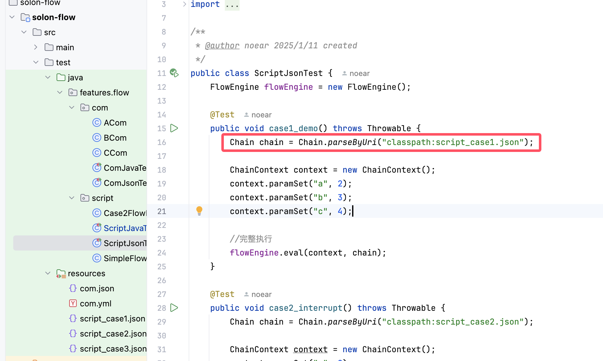

# How to Enhance Third-Party Framework's Extensibility Using the Nop Platform

The underlying layer of the Nop platform can seamlessly integrate with any well-designed third-party framework, requiring minimal code integration to significantly boost its extensibility.

Recently, the Solon framework introduced a plugin for stream processing. Its example code clearly demonstrates how to integrate with the Nop platform's extension points.



In this example, **Chain** is a model object defined via JSON files, with its parsing and loading handled by the `Chain.parseByUrl` function.

By integrating with the Nop platform, you can directly replace `Chain.parseByUrl` with `ResourceComponentManager.loadComponentModel(path)` and move the JSON file to the `resources/_vfs` directory.

After this modification, the following capabilities become immediately available:

1. The parsed result will be automatically cached. It will only be truly loaded when the cache is missing.
2. If you want to customize a model file without modifying the original, simply create a corresponding file in the `resources/_delta/default` directory. The Nop platform will prioritize loading Delta directory files.
3. To store models in a database instead of the classpath, introduce a DAO protocol such as `dao:Chain/my-task/v1`.
4. For large files, you can use the `x:extends` syntax to import base files at any nesting level. The current node and imported nodes will automatically merge, enabling model file fragmentation and reassembly.
5. The ResourceComponentManager will track model dependencies. If any dependency files change, it will automatically invalidate the model cache.
6. Dynamic generation of model nodes can be achieved using mechanisms like `x:gen-extends` and `x:post-extends`, providing highly flexible double abstraction.
7. After implementing Nop platform, you no longer need to design custom import mechanisms within your model files.

```json
{
  "x:gen-extends": "<chain-gen:GenBaseFlow xpl:lib='/xlib/chain-gen.xlib'/>",
  "steps": [
    {
      "x:extends": "my-step.chain.json",
      "name": "step1",
      "ui:hidden": false
    }
  ]
}
```

Implementing these features manually would require several thousand lines of code.

```java
interface IDeltaModelLoader{
  <T> T loadDeltaModel(String path, Class<T> clazz);
}
```

For example, introducing the above-defined `IDeltaModelLoader` interface and using the DeltaFileSystem to locate the corresponding files enables JSON-level delta merging, ultimately converting into a specified Java model class.

**No runtime code changes are needed for Solon framework.** Only replace model loader calls with `ResourceComponentManager.loadComponentModel(path)` to gain Nop platform's delta customization capabilities and powerful meta-programming abstraction. Using Delta customization allows all JSON files to be bundled into the JAR file without modifying the jar's files, simply by adding additional delta configurations. You can choose to either replace the entire model file or customize specific attributes within the model file.

## Model Enhancement

By supplementing your JSON files with an `xdef` meta-model, you can immediately unlock the following capabilities:

1. Define models using formats like XML, JSON, and YAML
2. Automatically generate corresponding Java classes for model files, enabling direct use in Java code
3. Implement syntax checking, code completion, and debugging in IDEA IDE
4. Use Excel to define model content without writing Excel parsing code, enabling complex nested structure mapping between models and Excel files
5. Model nodes support extended attributes. The XDef meta-model performs namespace checks automatically, skipping all namespaced attributes.
