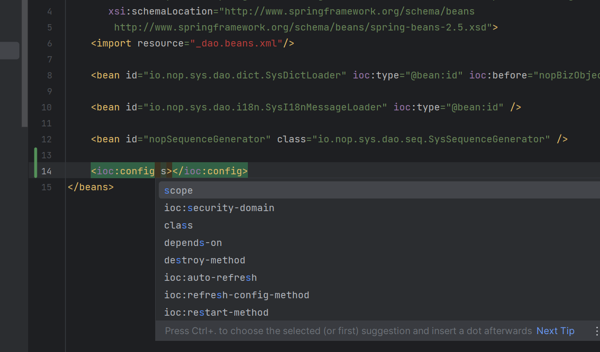

# XLang DSL Plugin

In the Nop platform, all DSLs use XML syntax format and employ a unified XDEF model to provide standardized constraints and basic attribute semantics. Based on the XDEF model, we can implement unified code suggestions, relationship analysis, breakpoint debugging, etc., without needing to write separate IDE plugins for each individual DSL language.

> The plugin's compilation and installation can be referenced in the document: [idea.md](../../dev-guide/ide/idea.md)

## DSL Syntax Format

The XLang DSL uses XML format, and the root node must specify the corresponding XDEF model using the `x:schema` attribute, such as:

```xml
<beans x:schema="/nop/schema/beans.xdef" 
       xmlns:x="/nop/schema/xdsl.xdef" ...>
</beans>
```

## Code Suggestions

When entering tag names, property names, or property values, the plugin will display relevant information defined in the XDEF.



## Syntax Checking

The plugin checks the format of tag names, property names, and property values based on the XDEF definition. Incompatible syntax elements will be marked with Error Markings.


## Quick Documentation

When hovering over tag names, property names, or property values, the plugin displays documentation defined in the XDEF file.


## Path Links

When hovering over the attribute value of the path format and pressing CTRL, it suggests jumping to the corresponding file. For XPL template tags, it suggests jumping to the tag library definition.


## Breakpoint Debugging

Breakpoints can be added in XScript scripts or Xpl template sections. The plugin includes an execution level comparable to Run and Debug commands, starting XLangDebug upon activation, which launches both Java debuggers and XLang script debuggers.


To debug XLang, the `nop-xlang-debugger` module needs to be included:

```xml
<dependency>
    <groupId>io.github.github.entropy-cloud</groupId>
    <artifactId>nop-xlang-debugger</artifactId>
    <version>2.0.0-SNAPSHOT</version>
</dependency>
```