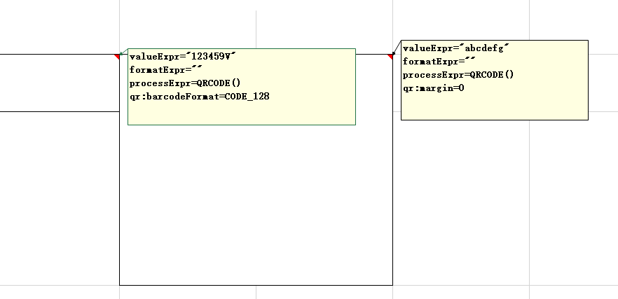

# How to Implement QR Code Export in NopReport

NopReport is a newly developed open-source report engine written from scratch. Despite its core consisting of only 3,000 lines of code, it has fully implemented the theoretical framework of nonlinear reporting defined by Chinese nonlinear report theory, including hierarchical coordinates and symmetric expansion algorithms.

## Introduction to Usage

* **Usage Introduction**: [NopReport, an Open-Source Report Engine in China: Implementation and Application](https://zhuanlan.zhihu.com/p/620250740)  
* **Video Explanation**: [Video Explanation of NopReport](https://www.bilibili.com/video/BV1Sa4y1K7tD/)

* **Code Analysis**: [Analysis of the Source Code of NopReport, an Open-Source Report Engine in China](https://zhuanlan.zhihu.com/p/663964073)  
* **Video Explanation**: [Video Explanation of NopReport's Source Code](https://www.bilibili.com/video/BV17g4y1o7wr/)

NopReport does not internally integrate QR code components related to business operations but adheres to reversible computation theory, enabling the integration of numerous expandable mechanisms. This document takes the implementation of QR code export as an example to explain the expandable mechanisms in NopReport, which are based on reversible computation theory and applicable not only within the Nop framework but also to other frameworks.

## Configuration for QR Code Export

The `nop-report-ext` module provides QR code components. When using, import the following JAR package:

```xml
<dependency>
    <groupId>io.github.entropy-cloud</groupId>
    <artifactId>nop-report-ext</artifactId>
</dependency>
```

In the Excel template, invoke the `QRCODE()` extension function through cell annotations. [Example Template](https://gitee.com/canonical-entropy/nop-entropy/raw/master/nop-report/nop-report-demo/src/main/resources/_vfs/nop/report/demo/base/11-%E6%89%93%E5%8D%B0%E6%9D%A1%E7%A0%81%E5%92%8C%E4%BA%8C%E7%BB%B4%E7%A0%81.xpt.xlsx)



* **valueExpr**: Here, `valueExpr` is used to directly specify the output value for demonstration purposes. In actual development, NopReport's built-in mechanisms can be utilized to generate cell values.
* **formatExpr**: Since the final output is in Excel and HTML pages, we do not need to output cell values here. Therefore, `formatExpr` should return an empty string to avoid adding unnecessary text to the QR code.
* **processExpr**: Invoke the `QRCODE` extension function to generate the QR code.
* **qr:barcodeFormat**: Specify the barcode format, defaulting to `QRCODE`. Set it to `CODE_128` for a specific barcode type.

The `qr:` prefix variable passes extended data to the `QRCODE` function but is not directly used as a parameter. The attribute values correspond to variables in the [QrcodeOptions.java](https://gitee.com/canonical-entropy/nop-entropy/blob/master/nop-integration/nop-integration-api/src/main/java/io/nop/integration/api/qrcode/QrcodeOptions.java) class.

The width and height of the output image can be specified using `qr:width` and `qr:height`. If not specified, the current cell's dimensions are used automatically.

## Implementation Principles

### 1. Expandable Attributes in Cell Model

NopReport's design adheres to reversible computation theory, employing a `(data, ext_data)` pairing design to ensure expandability at any model node. By default, attributes with namespace prefixes are excluded from model validation. This allows us to introduce the `qr` namespace for QR code configuration, setting parameters such as barcode format and size.

If QR code-related attributes in the `qr` namespace require validation, a custom xdef model can be introduced for validation.

## Implementation Details

### 1. QR Code Export Mechanism

The `nop-report-ext` module's QR code component supports configuring various parameters via the `qr:` prefix. These parameters are passed to the `QRCODE` function through the namespace, enabling dynamic QR code generation based on cell data and configuration.

### 2. Configuration Parameters

- **valueExpr**: Determines the value displayed in the QR code.
- **formatExpr**: Controls text formatting but is typically set to an empty string to avoid adding unnecessary text to the QR code.
- **qr:barcodeFormat**: Defines the barcode type, with `QRCODE` as the default.

### 3. Customizable Options

The `qr:` namespace allows for extensive customization:
- Set specific dimensions using `qr:width` and `qr:height`.
- Customize the appearance using additional parameters such as colors and fonts.
- Extend functionality by adding custom extension functions.

```xml
<workbook xdef:check-ns="qr">
  <sheets>
    <sheet>
      <table>
        <rows>
          <cell>
            <model xdef:name="XptCellModel"
                   qr:barcodeFormat="string" qr:margin="int" qr:imgType="string"
                   qr:width="double" qr:height="double" qr:encoding="string"
                   qr:errorCorrection="int">
              </model>
          </cell>
        </rows>
      </table>
    </sheet>
  </sheets>
</workbook>
```

Currently, NopReport uses Excel as a visualization designer. Cell annotations set cell model information. Subsequently, online visualization editing will be provided, allowing xdef metadata to automatically generate visualization pages.

### 2. Expandable Function Space

NopReport provides `expandExpr`, `valueExpr`, `formatExpr`, `styleIdExpr`, `processExpr`, and other types of expression configurations that allow calling external functions for complex logic processing. The NopReport expression engine is based on the internal XLang engine (with added hierarchical coordinate syntax in EL) and inherits global functions and objects defined in XLang. Additionally, the engine introduces a series of specialized functions into the execution environment.

#### Global Functions

```javascript
// Register XLang EL global functions
EvalGlobalRegistry.instance().registerStaticFunctions(GlobalFunctions.class);

// Register Report-specific functions
ReportFunctionProvider.INSTANCE.registerStaticFunctions(ReportExtFunctions.class);
```

In general, follow the approach in the `nop-report-ext` module by registering extended functions during initialization.

```java
public class ReportExtInitializer {

    @PostConstruct
    public void init() {
        ReportFunctionProvider.INSTANCE.registerStaticFunctions(ReportExtFunctions.class);
    }
}
```

#### Integration with IoC Container

In addition to global registration, functions can be injected directly into expressions using the `inject` function, such as `inject('qrService').genQrCode('123456')`.

> Due to support for the BeanScope concept similar to Spring's container, NopIoC-managed beans may not all be singletons by default.

#### Injection at Runtime

When calling specific reports, additional context can be passed via the scope object:

```javascript
IEvalScope scope = XLang.newEvalScope();
scope.setLocalValue("myTool", new MyTool());
reportEngine.getRenderer("/my.xpt.xlsx","html").generateToFile(file, scope);
```

In expressions, methods of the myTool object can be called directly, such as `myTool.myMethod(cell.value)`.

#### Definition Within Reports

The NopReport engine differs significantly from typical report engines in that it emphasizes self-containedness and custom abstraction capabilities. In the model's "expand" configuration, functions defined solely for use within the specific report can be created without external registration or input. These definitions are stored within the report model.


In the "expand" configuration, abstract tag libraries from the XPL template language can be used to dynamically load external tag functions. In the future, Nop will provide a universal logic design tool for all XPL configurations, enabling visualization and editing of custom functions within reports through a user-friendly interface.


The Nop platform provides a series of standardized approaches for developing custom domain models and domain-specific languages (DSL). This includes the concept of implicit context introduced within expression languages.

When working within a specific domain (or business scenario), there is always some systemic background knowledge. When writing specific business code, we can assume this background knowledge is known or can be derived deterministically without needing to explicitly state it in the code. However, in practice, we often use general-purpose languages and frameworks that lack a standardized method for embedding such knowledge into the language. This results in "glue" code where background information is repeatedly expressed.

For example, in a reporting engine, our background knowledge includes an `IXptRuntime` context object. Can this context be implicitly passed when calling functions, or must it be explicitly transmitted? If we do not want to explicitly pass `IXptRuntime` when invoking all functions, the common approach is to use `ThreadLocal` to approximate global variables, which modifies the structure of functions and introduces unnecessary complexity.

The Nop platform's XLang language introduces the concept of implicit parameters, similar to Scala's implicit syntax.

```scala
// Implicit parameters in Scala
def welcome(implicit name: String) = s"Welcome, $name!"

implicit val guestName: String = "Guest"

println(welcome) // Output: Welcome, Guest!
```

In Scala, the language automatically searches for implicit variables in the context and binds them as function parameters. The Nop platform's Xpl template language provides implicit parameters, but it uses `name` to implement implicit binding.

```xml
<!-- Library my.xlib -->

<lib>
  <tags>
    <MyTag>
      <attr name="xptRt" implicit="true" />
      <source>
        ...
      </source>
    </MyTag>
  </tags>
</lib>
```

When invoking tags, you can pass the `xptRt` parameter. Alternatively, you can omit it, and it will automatically bind to the context variable with the same name.

```xml
<my:MyTag />
```

In XLang expressions, the implicit transmission of `IEvalScope` is also provided.

```xml
@EvalMethod
public static ExcelImage QRCODE(IEvalScope scope) {
    IXptRuntime xptRt = IXptRuntime.fromScope(scope);
    ExpandedCell cell = xptRt.getCell();

    QrcodeOptions options = new QrcodeOptions();
    cell.getModel().readExtProps("qr:", true, options);
    ...
    return image;
}
```

If a function is annotated with `@EvalMethod`, the first parameter must be `IEvalScope`. When the expression is invoked, it will automatically pass the current scope. Using `scope`, you can access other variables in the context.

The `ReportExtFunctions` class defines the `QRCODE` function using this implicit parameter mechanism. Therefore, `IXptRuntime` does not need to be explicitly passed as a parameter. Within the `QRCODE` function, `IXptRuntime` is used to obtain the currently processing cell and its model's extended properties.

`QRCODE` function:
```xml
<ReportExtFunctions>
  <method name="QRCODE">
    <param type="IEvalScope" />
  </method>
</ReportExtFunctions>
```

