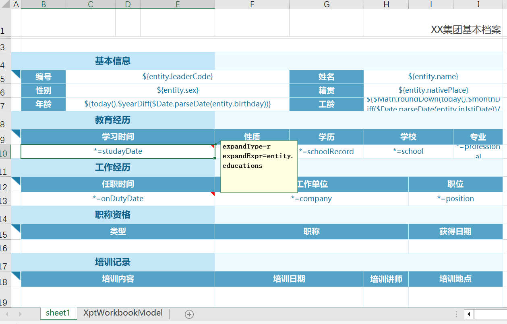
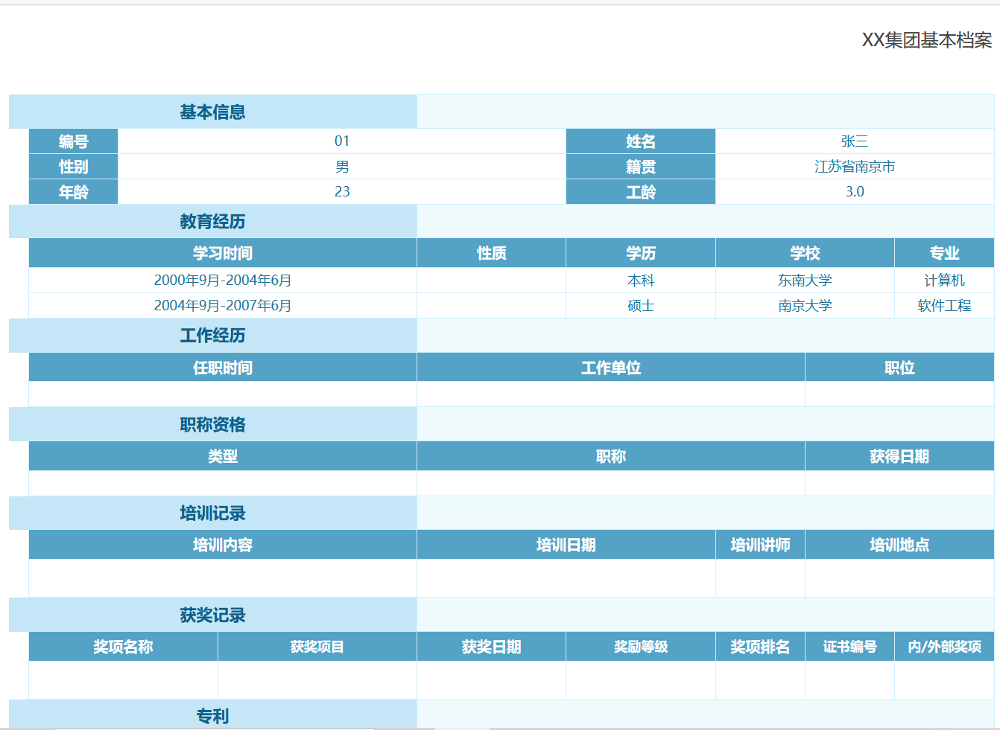
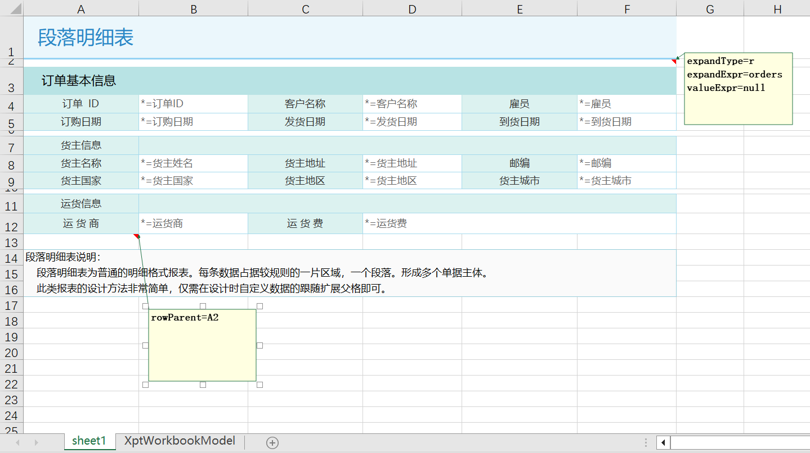
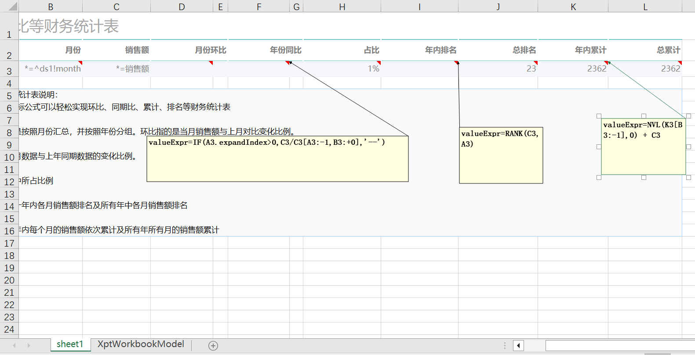
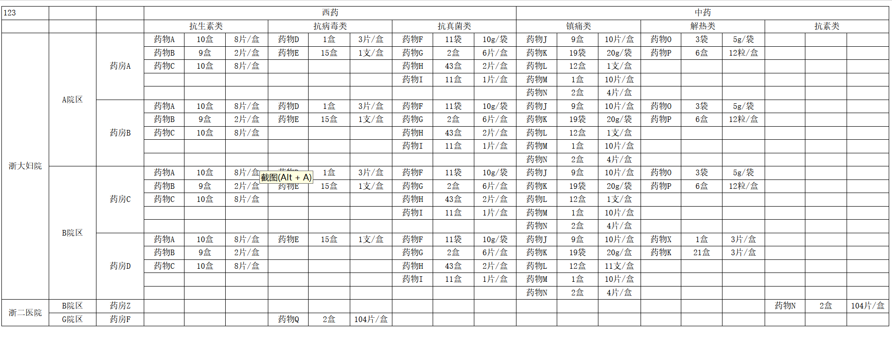
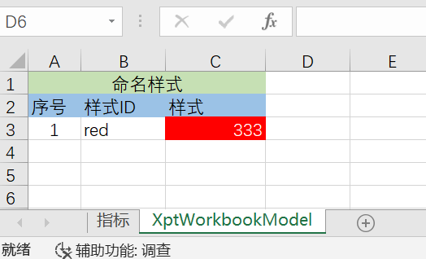

# Using Excel as the Designer for an Open-Source Chinese-Style Report Engine: NopReport

Chinese-style report is an umbrella term referring to complex structured reports commonly found in China's informationization field. It typically involves cross-tabulation, multi-level headers, and merging functionalities to present consolidated data.

[Why Does "Chinese-Style Report" Exist?](https://www.zhihu.com/question/519875794)

> [RuanQuan Report](http://www.raqsoft.com.cn/about#aboutme) was founded by Jiang Buqing, a legendary figure in Chinese history (the first gold medalist in the International Mathematical Olympiad from Xinjiang Shuanghe, see [Professor Gu's Memoirs](https://blog.sciencenet.cn/blog-2472277-1160241.html)), who invented related theories for the Chinese-style report model and led a generation of reporting software development.

Currently, most commercial tools support the creation of Chinese-style reports. Among open-source report engines, only [UReport](https://gitee.com/youseries_admin/ureport) supports Chinese-style reports, and it is no longer maintained.

NopReport is an open-source Chinese-style report engine implemented from scratch based on reversible computation theory. Its core code is concise, consisting of over 3,000 lines (see [nok-report-core](https://gitee.com/canonical-entropy/nop-entropy/tree/master/nop-report/nop-report-core)). It boasts high performance (performance test code see [TestReportSpeed.java](https://gitee.com/canonical-entropy/nop-entropy/blob/master/nop-report/nop-report-demo/src/test/java/io/nop/report/demo/TestReportSpeed.java)) and unmatched flexibility and expandability compared to other report engines.

NopReport is positioned in the [Nop Platform](https://gitee.com/canonical-entropy/nop-entropy) as a universal modeling tool for tabular data structures. All functionalities required to generate tabular data can be implemented using NopReport's report model objects. For example, the database reverse engineering functionality provided by NokCli (a command-line tool) analyzes database structures and generates Excel models. This Excel model is then converted into a report output model via **template import**.

Compared to other report engines, NopReport has the following distinct characteristics:


## 1. Using Excel as the Designer

[Operation Demonstration Video](https://www.bilibili.com/video/BV1Sa4y1K7tD/)

Based on reversible computation principles, a report engine's core function is essentially to define a DSL (domain-specific language) tailored for tabular data structures (see [workbook.xdef](https://gitee.com/canonical-entropy/nop-entropy/blob/master/nop-xdefs/src/main/resources/_vfs/nop/schema/excel/workbook.xdef)). While the visualization designer is merely one of several forms to represent this DSL, the NokPlatform aims to establish a model-driven code generator. By parsing and generating Excel files and with minimal additional extensions, Excel can be utilized as a report designer. Specifically, Excel's cell annotations are treated as extended metadata. The current NopReport supports the following types of reports:


### 1. Case Studies


### 1.1 Profile Reports





### 1.2 Detailed Tables




### 1.3 Complex Multi-source Reports


### 1.4 Cross-tabular Reports—Bidirectional Expansion


### 1.5 Financial Statements—Comparison and Trends







The folding of the D2 grid will result in multiple instances of D3 being copied, while during the execution of row expansion by D3, multiple brother nodes will be created simultaneously.

When brother nodes undergo row expansion, new rows are automatically shared. Consequently, the parent node is ultimately expanded into as many rows as determined by the total count of all child nodes.


### Excel Model Extension

The NopReport report model can be considered an extension of the Excel model. In the annotation of a cell, we can specify the direction and content of cell expansion using attributes such as `expandType`, `expandExpr`, and `field`. Additionally, within the cell's content, we can directly write expression syntax.


## Expression Syntax Support

The report engine supports two types of expression syntax:

1. **EL Expressions**: For example, `${entity.myField}`
2. **Expansion Expressions**: It uses `*=` as a prefix.
   - `*=fieldName` is equivalent to `field=fieldName`
   - `*=^ds1!fieldName` is equivalent to `expandType=r, ds=ds1, field=fieldName`
   - `*=>ds1!fieldName` is equivalent to `expandType=c, ds=ds1, field=fieldName`
   - `*=^fieldName@entity.children` is equivalent to `expandType=r, field=fieldName, expandExpr=entity.children`

Detailed information can be found in the document [xpt-report.md](../dev-guide/report/xpt-report.md).


## Flexible Data Object Support

Traditional report engines typically only support flat data structures and basic operations. They first establish a data source (DataSource) and then build a dataset (DataSet), which maps to tables or views in the database. The dataset manages individual records.

The advantage of this approach is its simplicity and generalization, allowing the engine to operate independently of the business system. However, the disadvantage is that it cannot directly utilize existing domain models within the application or leverage intrinsic relationships between domain entities for optimization.

NopReport, on the other hand, employs a more flexible and open layered design. Its runtime operates directly toward domain model objects, with DataSet serving as an optional data organization form. For example, in the previous section's archive-style report, we construct report data using JSON variables:


When expanding【education history】, only `expandType=r` and `expandExpr=entity.educations` are needed.

Similar to SoftReport's reporting tools, which require multiple datasets (`ds_study`, `ds_work`, etc.), we need to define filter conditions between these datasets. In NopReport, however, we assume user information is organized hierarchically, and the user object retrieved from NopOrm can be directly passed to the report engine without redefining a dedicated data set for reporting.

NopOrm has been optimized for object association properties, resolving common ORM issues such as the [N+1 problem](https://zhuanlan.zhihu.com/p/545063021). Its usage aligns well with business intuition in terms of parent-child relationships.

NopReport does not impose any specific data source requirements. In the【before expansion】configuration section, we can use Xpl templates for free-form processing.

General report engines can design datasets using visualization designers. Based on reversible computation principles, NopReport's engine can actually mimic this behavior to some extent.

For example,【before expansion】, we can introduce Xpl abstract tags to encapsulate specific dataset retrieval methods.


```xml
<xpt-rt:UseJdbcDataSet dsName="ds1" xpl:lib="/nop/report/xlib/xpt-rt.xlib">
  <soure> select xx from yy where type=${type} </soure>
</xpt-rt:UseJdbcDataSet>
```

The `<xpt-rt:UseJdbcDataSet>` tag can be viewed as a configuration file, utilizing Nop's GenericTreeEditor (currently in development) to automatically generate dataset visualization designs.

Using Nop as the foundation, we can accumulate domain models tailored to specific fields without relying entirely on platform-provided data models.


The following expression formats are supported:

1. EL Expressions: For example, `${entity.myField}`
2. Expansion Expressions: Uses `*=` as a prefix.
   - `*=fieldName` is equivalent to `field=fieldName`
   - `*=^ds1!fieldName` is equivalent to `expandType=r, ds=ds1, field=fieldName`
   - `*=>ds1!fieldName` is equivalent to `expandType=c, ds=ds1, field=fieldName`
   - `*=^fieldName@entity.children` is equivalent to `expandType=r, field=fieldName, expandExpr=entity.children`


For example:
```xml
<xpt-rt:UseJdbcDataSet dsName="ds1" xpl:lib="/nop/report/xlib/xpt-rt.xlib">
  <soure> select xx from yy where type=${type} </soure>
</xpt-rt:UseJdbcDataSet>
```

This code snippet demonstrates the use of `<xpt-rt:UseJdbcDataSet>` for querying data from a JDBC connection.


In **Chinese-style report theory**, a unique aspect is the so-called **Hierarchical Coordinates**. For example, `B2[A2:+1]` indicates the value of the next B2 cell in the vertical direction relative to the current A2 cell.

To support hierarchical coordinates, most report engines introduce dedicated expression engines with their own syntax and functions, leading to significant differences from general business development expressions. This makes it difficult to reuse existing code or learn the expression syntax directly.

**NopReport**, on the other hand, uses the **XScript** expression engine. It extends the XScript syntax (similar to JavaScript) to include hierarchical coordinates. In fact, only a few dozen lines of code are needed for an expression engine to support hierarchical coordinates. For reference, see [ReportExpressionParser.java](https://gitee.com/canonical-entropy/nop-entropy/blob/master/nop-report/nop-report-core/src/main/java/io/nop/report/core/expr/ReportExpressionParser.java).

Each coordinate expression returns an `ExpandedCellSet` object.

```java
class ExpandedCellSet implements Iterable<Object> {
    List<ExpandedCell> cells;

    @Override
    public Iterator<Object> iterator() {
        return cells.stream()
                    .map(ExpandedCell::getValue)
                    .iterator();
    }

    public ExpandedCellSet filter(Predicate<ExpandedCell> filter) {
        List<ExpandedCell> list = cells.stream()
                                        .filter(filter)
                                        .collect(Collectors.toList());
        return new ExpandedCellSet(cells, expr + "{ filter }", list);
    }
}
```


NopReport's hierarchical coordinates syntax does not support **Filter** conditions directly. However, the `ExpandedCellSet` object returned by expressions has a `filter` method that can be used to achieve similar functionality.

The `ExpandedCellSet` class implements the `Iterable` interface, allowing it to be used directly in business functions like SUM:

```java
public static Number SUM(@Name("values") Object values) {
    if (values == null)
        return null;

    Iterator<Object> it = CollectionHelper.toIterator(values, true);
    Number ret = 0;

    while (it.hasNext()) {
        Object value = it.next();
        if (!(value instanceof Number))
            continue;
        ret = MathHelper.add(ret, value);
    }
    return ret;
}
```


There is no need to explicitly identify or handle the `ExpandedCellSet` type. The support for hierarchical coordinates in data sets is fully encapsulated within the `ReportDataSet` type, requiring no special customization in the expression engine.

```java
class ReportDataSet{
    @EvalMethod
    public Number sum(IEvalScope scope, String field) {
        List<Object> items = current(scope);
        Number ret = 0;
        for (Object item : items) {
            Object value = getFieldValue(item, field);
            if (!StringHelper.isEmptyObject(value)) {
                ret = MathHelper.add(ret, value);
            }
        }
        return ret;
    }
}
```

`@EvalMethod` is a syntax mark recognized by XScript. It indicates that when the expression is called, the `scope` environment object will be automatically passed. For example, `ds.sum('amount')` will call the `ReportDataSet.sum(IEvalScope, String)` method. The `current` function determines the hierarchical coordinate based on implicitly passed `scope`, then identifies which data entries satisfy that hierarchical condition.

In the previous section, for obtaining the total number in a multi-source report, we used an expression configuration `valueExpr=zs.where('ID', xptRt.field('ID')).sum('quantity')`, which is a standard JavaScript function call. In Fleet's configuration, we need to set inter-data-set filtering conditions and special data-set invocation expressions such as `zs.sum('quantity')`.

In the Nop platform, custom encapsulated functions can be easily introduced into the expression calculation process without requiring all functions to be predefined by the report engine. For example, in the "expanded before" configuration, we add functions specific to the current report, rather than registering them as global functions.

```java
function myFunc(a){
    return ...
}
assign("myFunc", myFunc); // myFunc can now be used in the current report's expressions.
```

In the `ReportFunctions` class added in the codebase, static methods are automatically registered as global report functions in the `ReportFunctionProvider.INSTANCE`. These functions become available for use in expressions of the current report.

## 4. Performance Optimization-friendly Design

NopReport implemented a significant structural optimization and significantly simplified the hierarchical expansion algorithm used in multi-source reports.

The most basic expandable cell object uses a one-way linked list structure. When frequent cell insertions are performed, this structure can improve performance.

```java
class ExpandedCell{
    ExpandedCell down;
    ExpandedCell right;

    ExpandedCell rowParent;
    ExpandedCell colParent;

    ExpandedRow row;
    ExpandedCol col;

    Map<String, List<ExpandedCell>> rowDescendants;

    Map<String, List<ExpandedCell>> colDescendants;
}

class ExpandedRow {
    ExpandedCell firstCell;
}

class ExpandedCol{
    ExpandedCell firstCell;
}

class ExpandedTable{
    List<ExpandedCell> rows;
    List<ExpandedCell> cols;
}
```

The `ExpandedCell` object was enhanced with expanded attributes to support caching of intermediate calculation results during the expression evaluation process. This optimization helps reduce redundant calculations and improves overall performance.

```java
class ExpandedCell{
    /**
     * Cache dynamic computed values related to the cell
     */
    private Map<String, Object> computedValues;
}
```

```java
public Object getComputed(String key, Function<ExpandedCell, Object> fn) {
    if (computedValues == null) {
        computedValues = new HashMap<>();
    }
    return computedValues.computeIfAbsent(key, k -> fn.apply(this));
}
```

```java
@EvalMethod
public static Number PROPORTION(IEvalScope scope,
                            @Name("cell") ExpandedCellSet cell,
                            @Name("range") @Optional ExpandedCellSet range) {
    IXptRuntime xptRt = IXptRuntime.fromScope(scope);
    Object value = cell.getValue();
    if (value == null)
        return null;

    Number v = ConvertHelper.toNumber(value, err -> new NopException(err).source(cell).param(ARG_EXPR, cell));
    String cellName = cell.getCellName();

    ExpandedCell rangeCell = range.getCell();
    // Use the computation property of the first cell to cache the aggregated result
    Number sum = (Number) rangeCell.getComputed(cellName + '_' + XptConstants.KEY_ALL_SUM,
            c -> SUM(rangeCell.getChildSet(cellName, xptRt)));
    return MathHelper.divide(v, sum);
}
```

We utilized the computation property of the first cell to cache the aggregated result.

## Five. Multi-sheet support and loop generation

The design of NopReport supports multi-sheet pages. You can add multiple sheet pages in Excel, each with its own configuration. Additionally, you can configure a **loop variable** to dynamically determine how many sheet pages to generate and the names of each sheet page. Using this mechanism, generating a report in a file format is much easier.

## Six. Java调用

具体使用示例请参考[TestReportFile.java](https://gitee.com/canonical-entropy/nop-entropy/tree/master/nop-report/nop-report-core/src/test/java/io/nop/report/core/TestReportFile.java)
```javascript
IReportEngine reportEngine = new ReportEngine();
File xptFile = attachmentFile("test.xpt.xlsx");
ExcelWorkbook xptModel = new XptModelLoader().loadModelFromResource(new FileResource(xptFile));
ITemplateOutput output = reportEngine.getRendererForXptModel(xptModel, "xlsx");

IEvalScope scope = XLang.newEvalScope();
scope.setLocalValue("title", "Test Report, Title Display in Upper Right Corner");

File outputFile = getTargetFile("output.xlsx");
output.generateToFile(outputFile, scope);
```

Variables can be passed to the report using the `scope` object. These variables can then be used directly within the report expressions, and further processed or calculated at various stages such as【展开前】(before expansion).

In the【展开前】configuration, dynamic processing of data can be performed using xpl template language and XScript script language.

* The `import` keyword can be used to import Java classes.
* The `inject` method (beanName) can be used to inject beans from an IoC container.

## Style Styles
The style of a cell can be dynamically determined based on conditions.

1. In the report template, add an XptWorkbookModel sheet named "Named Styles".
   

2. Configure the `styleIdExpr`
```javascript
styleIdExpr = (cell.ev === 2002) ? 'red' : null;
```

