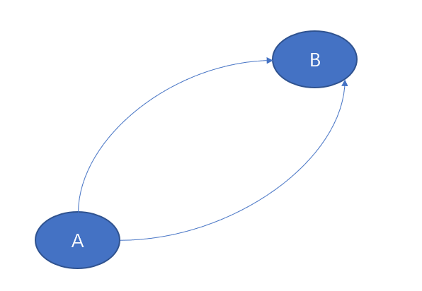

# 再谈百度AMIS框架和声明式编程

对于我的上一篇文章[为什么百度AMIS框架是一个优秀的设计](https://zhuanlan.zhihu.com/p/599773955)，有人提出一个疑问：AMIS中所定义的[Api对象](https://aisuda.bce.baidu.com/amis/zh-CN/docs/types/api)是否有必要？采用传统的事件监听的方式完全可以解决问题，有什么必要引入一个额外的概念？

为了回答这个问题，我们还是来看一个具体的示例：

```json
{
    "type": "form",
    "body":[
        {
        "type": "select",
           "name": "a",
           "options" : [ ...]
        },
        {
            "type": "select",
            "name": "b",
            "source": {
                "method" : "post",
                "url" : "/get-related-options",
                "data": {
                     "value": "${a}"
                 }
            }
        }
    ]
}
```

在上面的例子中，第一个下拉选择控件的name为a，表示它的选择值对应于上下文环境中的名称为a的变量，下拉选择控件可以看作是这一变量的查看器和修改器。另一个select控件的source属性对应于一个[Api类型的对象](https://aisuda.bce.baidu.com/amis/zh-CN/docs/types/api)，它通过数据绑定表达式监听了变量a的变化，当a发生变化的时候，会自动执行ajax调用获取到新的下拉选项列表。

在这个示例中，select控件的事件绑定以及事件触发处理过程都是隐式的。我们没有看到明确的事件触发的时机，也无法直接介入事件的处理过程。那么这是否意味着我们丧失了对程序逻辑的细粒度的控制能力？

其实回想一下前端框架的发展历程就会发现，这并不是一个需要担心的问题，因为**我们一直都走在放弃对底层的细粒度控制的道路上**。在jQuery流行的时代，我们需要频繁的操作底层的DOM模型对象，调用DOM对象上的方法来查找子节点、更新属性等。例如，为了实现对一个列表数据的编辑，新增、修改、删除操作都需要监听对应操作按钮的click事件，然后根据class或者id等找到对应DOM对象，调用对象上的方法来更新界面。而在现代的Vue和React框架中，**DOM对象的存在感已经降到了极低的程度**，虚拟DOM仅仅是我们用模板或者JSX生成的一种数据记录，而不是具有独立存在价值、拥有大量属性方法的对象。基于虚拟DOM的概念，我们只需要编写一个针对当前状态数据的render函数，前端框架在状态数据发生新增、修改、删除变化时，会**自动推导**得到界面的更新逻辑。

放弃了对DOM对象的显式使用以及DOM更新过程的细粒度的控制，我们收获的是更紧凑的业务逻辑表达方式，以及可以迁移到非浏览器运行环境中的React Native技术。

> 现在很多数据驱动的框架也在逐步增强自己的**可观测性**，可以通过watch、subscribe等方式监听数据的变化，甚至支持历史记录、时光回溯等功能。这里和事件监听的区别在于我们不是监听某种与业务无关的组件事件，而是直接监听业务数据的变化或者是具有明确业务含义的action动作。

## 声明式 vs. 命令式

  前端框架的发展历程可以看作是一个不断从命令式编程范式向声明式编程范式转换的过程。



命令式是我们明确指定从A到B的一条执行路径，每一步的细节都在我们的掌握之中，而声明式则只是声明我们需要从A迁移到B，因为可能存在多条潜在的路径，系统会根据某种规则或者成本核算，**自动推导**得到从A到B的一条具体路径。

因为声明式只关注路径的端点，而忽略了很多细节，这样就很自然的引入了优化实现的机会。例如，在Vue框架和React框架中，render函数产生的虚拟DOM表示了我们期望产生的界面结构，通过虚拟DOM Diff操作，我们可以分析得到相对于前一个状态，界面中实际发生变化的部分，然后自动生成一个最优的DOM变更策略。而如果手工编写DOM读写方法，反而可能因为不优化的读写顺序，导致浏览器布局引擎多次执行，性能低下。

声明式只关注最终状态的影响，对中间过程的精确执行步骤和顺序并不关心，往往可以利用缓存、延迟处理等方式实现优化。例如，一次事件触发的过程中可能导致状态变量多次被修改，我们只需要保证最后一次修改的结果可以被**最终**体现到界面变更上即可，而此前的多次更改动作可以被自动的忽略。

状态是路径的端点，实际上也就是路径的表面(surface)。当我们考察业务状态所组成的状态空间时，一般会发现**需要关注的状态的数量远远少于可能出现的状态变迁路径的数量**（类似于降维）。例如，如果我们的数据绑定表达式只用到了状态变量a，则无论从哪条迁移路径到达了状态a=1，则它所触发的相关联动计算都是一模一样的。

> 在物理学中，我们在入门的时候学习的都是牛顿力学，采用的是力的概念，总是关注物体运行的精确路径，以及在运行路径的每一点所受到的外力的作用。但是，在更高级一些的物理学表述中，我们实际采用的都是基于能量和作用量的观点，通过求解状态空间中两点之间满足作用量最小化的优化路径来得到真实物理世界中所发生的过程。

在AMIS这种低代码前端框架中，会尽量利用响应式数据绑定机制来实现信息传递，从而最大程度的减少对命令式代码的需求，提升整个页面中声明式描述的占比。仔细思考一下就会发现，**在全面采用响应式数据绑定机制之后，组件对象这一概念本身的重要性也随之下降**（类似于DOM对象），在具体实现层面，我们甚至可以不要求底层实现提供对应的组件结构！

```html
<select id="a" onchange="handleChange">
</select>
<select id="b">
</selection>

<script>
function handleChange(value){
    fetchRelatedOptions(value).then(result=>{
        getComponent('b').setOptions(result)
    })
}
</script>
```

在传统的事件监听处理函数中，我们会获取到相关的组件对象，并调用组件上的方法，比如上面的getComponent('b').setOptions(result)，这要求系统在运行时一定要存在程序代码可访问的组件对象，并且它必须提供一个成员函数setOptions。而使用响应式的Api对象时我们表达业务逻辑时可以完全不触及到Component这个概念，**所有输入输出和处理过程都是业务相关的状态数据**，而不是与前端界面展示相关的组件对象和组件属性。AMIS的JSON描述仅仅是输入给底层引擎的描述信息，**并不要求在运行时一定存在对应的组件**，也不要求底层的组件提供JSON描述中所用到的属性。我们完全可以在编译期将一个复杂组件分解为多个原子组件，底层的运行时只要支持某些原子组件即可。例如，在Nop平台中，我们在AMIS JSON的基础上提供了一种编译期控件，在AMIS JSON的加载过程中，我们会识别编译期的XPL标签，然后执行这些标签来动态产生AMIS描述。这可以看作是一种纯函数式的组件，但它只在编译期存在，而在运行期不存在。

> AMIS在实际加载JSON描述时，也进行了一些结构变换以处理版本兼容性，比如转换废弃的属性名等。如果我们在编程时明确使用了这些组件属性名，则显然兼容性处理会变得更加艰难。

## 数据绑定的自然演化: 从computed到Api

AMIS中的[Api对象](https://aisuda.bce.baidu.com/amis/zh-CN/docs/types/api)可以看作是响应式数据绑定机制的一种自然演化的结果。

在Vue3.0中，传给控件的属性值存在三种情况: 1. 固定的值  2. 变量值  3. Ref引用(Reactive对象在概念层面可以看作是一种特殊的Ref)。**Ref引用相当于是一种信息传递的管道**：一次构建（传入和持有Ref），多次使用（每次Ref中流过新的值都会触发外部的observer自动执行）。为了最大化这种信息管道的价值，我们显然**需要尽量丰富管道数据的来源**，并支持对管道数据进行再次组合与加工。

[computed](https://vue3js.cn/reactivity/computed.html)是一种特殊的Ref，它不再是一个简单的、可变的值，而是关联了一段可执行代码。computed本质上就是对于一个函数的封装，但是我们只关注它的返回值，所以**从数据视角上来说，函数成为了一个带有自动更新功能的响应式的值**。所有需要用到值的地方，我们都可以很自然的塞入一个computed值。

**computed是对一个同步函数的Ref封装，而AMIS的Api对象可以看作是对远程异步调用函数的Ref封装**。在此基础上，我们可以进一步封装流式数据，这就是AMIS中的Service容器。Service容器可以封装一个WebSocket连接，每当接收到后台数据时都自动更新当前的值。也可以定时执行轮询调用，获取数据后更新当前的值。

> 个人观点是如果从头开始设计，AMIS的Service和Api对象的概念可以合并，并将Service容器加载Schema的功能独立出来。


# 总结

从声明式编程的角度上说，AMIS框架引入Api对象完全是非常合理和自然的一种选择。