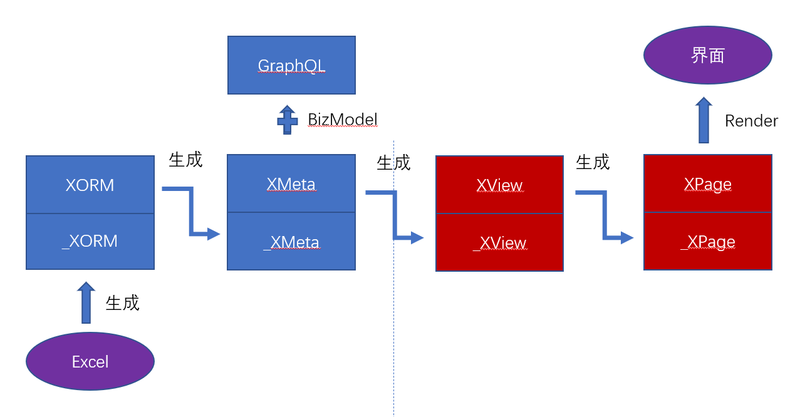

# 关于"为什么XLang是一门创新的程序语言"一文的进一步解释

XLang语言是下一代开源低代码平台Nop平台底层的关键性支撑技术。传统的支持泛型元编程的程序语言在结构层面对应于构造公式 `Map = Map extends Map<Map>`，而XLang相当于是将这一公式扩展为`Tree = Tree x-extends Tree<Tree>`。也就是将Map扩展为Tree，同时将Map结构之间的extends运算被扩展为Tree结构上的`x-extends`运算，特别是`x-extends`增加了逆向删除的语义。

XLang语言之所以是一门创新的程序语言，是因为它创造了一个新的程序结构空间，在这个结构空间中可以很方便的实现可逆计算理论所提出的`Y = F(X) + Delta`的计算范式。这一概念的创新性很强，是超出了传统计算机科学思维惯性的一种研究视角，所以一些科班出身的朋友理解起来反而出现了额外的思维障碍。

此前我在公众号上发表了两篇专门讲解XLang语言的设计原理的文章，[为什么说XLang是一门创新的程序语言?](https://mp.weixin.qq.com/s/O4VeA7Dw8cRF7HTHxi6pNw)和[关于"为什么说XLang是一门创新的程序语言"一文的答疑](https://mp.weixin.qq.com/s/XtqjqoC8bhDSuCwGhrMbnw)，并用DeepSeek生成了一篇通俗解释[DeepSeek的通俗版解释：XLang为什么是一门创新的编程语言？](https://mp.weixin.qq.com/s/GsGrmaXMqKmmrYW7EuAuig)。一位朋友在知乎上留言：

> 耐性读完了您的两篇大作，我要说完全看不懂，那是昧着良心说话，但是看懂一点点比完全看不懂更让人困惑：您这XLang是干什么用的？是一个超级的注册表形式的数据结构吗？要怎么实现你说的（或者我以为的）宏伟目标？函数在你这语言中是否是一等公民？

这种疑惑很常见，本质上是因为XLang所依据的理论原理来自于数学和物理学，所以仅受过计算机科班教育的同学将XLang的概念向自己熟悉的计算机领域的概念映射时，会出现种种心理上的不适的感觉。**一个人很难理解他尚未理解的事物**，而他已经接受的某些事物往往会被不自觉的看作是天经地义、理所当然的，对于偏离现有理解的认知会自动的无视甚至抗拒。在本文中我再针对性的进行一些解释，如果有问题欢迎留言讨论。

## 一. XLang是干什么用的？

**XLang的主要用途是用于快速开发和扩展领域特定语言，实现所谓的面向语言编程范式(Language Oriented Programming)**。面向语言编程范式并不是我发明的一个概念，它是计算机科学领域中已经存在了很多年的概念，比如1994年的这篇论文[[PDF] Language-Oriented Programming | Semantic Scholar](https://www.semanticscholar.org/paper/Language-Oriented-Programming-Ward/825a90a7eaebd7082d883b198e1a218295e0ed3b)。

我们平时实现业务都是使用通用程序语言，而面向语言编程范式强调领域特定语言（DSL, Domain Specific Language）的作用，开发业务时总是先开发一个专用于这个业务领域的DSL，然后再用这个DSL去表达业务逻辑。开发了IDEA集成开发工具的JetBrains公司就有一个相关的技术产品[MPS(Meta Programming System)](https://www.jetbrains.com/mps/)。

使用XLang来开发一个新的DSL非常简单，简单到只需要增加一个XDef元模型定义文件，然后你就可以立刻得到一个新的DSL。Nop平台提供了一个通用的IDEA插件，可以自动读取XDef元模型，实现自定义DSL的语法提示、链接跳转、断点调试等功能，后续还会自动实现类型推导等。Nop平台的基础设施自动根据XDef元模型文件生成模型类定义，自动实现解析器和验证器，并自动生成可视化编辑器等。

使用XLang定义的DSL语言不需要自己去考虑扩展性问题（也不用设计相关语法），而且也不需要考虑多个DSL如何无缝集成在一起使用的问题。它们由Nop平台的底层基础设施统一实现。在DSL文件中通过`x:extends`，`x:gen-extends`等内置语法自动实现模型分解合并、编译期元编程等。

如果要扩展一个已有的DSL的语法也非常简单，只需要增加一个XDef元模型文件，指定这个XDef元模型文件从已有的XDef元模型文件继承就可以。

使用XLang的DSL所开发的所有的软件产品都自动支持所谓的Delta定制机制，也就是在完全不修改已有源代码的情况下，在Delta目录下增加Delta文件，就可以修改、删除已有逻辑，当然也可以实现新增逻辑。

XLang所提供的这些能力是**此前所有程序语言都不具备的创新能力**。它对于Nop平台解决粗粒度的、系统级别的软件复用至关重要。也就是说，ToB市场中最难解决的定制化开发问题在Nop平台的技术架构下可以得到本质上的改善，特别是基础产品的架构可以完全不受到定制开发的影响。

* **一个使用XLang开发的银行核心应用，在完全不修改基础产品源码的情况下，通过在Delta目录下增加Delta差量文件就可以定制从数据模型，到业务逻辑，再到前端显示界面的所有逻辑**。

* 一个使用XLang开发的低代码平台，在完全不需要修改平台本身的代码的情况下，通过同样的Delta定制方案，就可以定制这个低代码平台中所有可视化设计器的界面和编辑功能，甚至可以定制被编辑的模型对象。

## 二. XLang是一个超级的注册表形式的数据结构吗？

用注册表去理解XLang就相当于是用链表去理解Lisp：虽然有关系但是关系不大。

在使用现有的程序语言去做抽象时，我们一般所定义都是离散的扩展点，这些离散的扩展点可以用一个类似注册表的结构管理起来。这种思想非常根深蒂固，比如华为的TinyEngine低代码引擎在提到自己2.0版本的设计时，特别强调了**通过注册表机制，可以轻松地对组件、API等内容进行替换，实现灵活的插拔和定制**。参见[TinyEngine低代码引擎2.0新特性介绍](https://mp.weixin.qq.com/s/oX73EX3ZFpk3i6MupiYKZA)。

对于一个已有的实现，比如ABC，如果我们想把它改造成可扩展的抽象，最常见的方案就是变量抽取，比如 `A{X:B}C`，将B替换为一个变量X，然后通过一个变量映射的Map（本质上就是一种注册表）为X指定具体的值。为了减少配置量，我们还可以给它指定一个缺省值B，并宣称这是一种设计原则，即所谓的约定大于配置。**这种方案相当于是在有可能需要修改的地方挖个洞，然后根据需求，为这个洞填上不同的内容**。

> 这种方案也可以被解释为增加一层间接性：任何解决不了的问题都可以通过增加一次指针跳转来解决，如果仍然解决不了，就再增加一层。

如果只有少数地方有可能需要扩展，那么事先挖几个洞是很简单的事情。但是如果事前不知道哪里需要变化，而且很多地方都可能会发生变化呢？ **如果所有地方都挖上洞，那么原有的架构就完全空洞化了，它还有什么存在的意义呢**？挖洞不仅仅有成本，而且会影响系统的运行时性能，也增加了系统的理解难度。事先挖的洞有可能用不上，甚至还会为真正需要的扩展制造障碍。比如 `ABC`挖洞后成为`{X}{Y}C`，结果实际需求既不是替换X，也不是替换Y，而是替换Y的一部分和C的一部分，这要怎么办？

**每个扩展点可以被看作是一个扩展自由度，扩展点不断增加相当于扩展空间的自由度在不断增加**，那么当扩展空间的自由度无限增加的时候，我们能不能建立一种合适的抽象手段？传统的软件构造理论中对于这个问题的回答是否定的。在现有的理论体系中，我们需要依赖于事前的预测来预置扩展点，而不可能在事后不修改原始系统代码的情况下增加或者修改扩展点，当然也不可能在不修改源码的情况下去除扩展点。

**XLang解决无限扩展自由度问题的方法，是仿照物理学引入新的概念：坐标系。本质上是从刚体力学的世界观转向场论的世界观**。在高中阶段我们所学习的牛顿物理学是所谓古典力学中的刚体力学。它的世界观是完全机械化的：刚体的运动完全由它的质心坐标和尺寸形状朝向等少数几个参数来描述，刚体的内部构造无法被观测也无关紧要，刚体之间通过直接接触发生相互作用，刚体的形状必须精确匹配才能构成一个无缝的整体（可以对比一下软件组件的黑箱模型）。即使是在古典力学中，稍微高级一点的观点也都会转换到拉格朗日表述或者哈密尔顿表述，它的精神实质是转向**场论的世界观**。所谓的场（Field），其实就是**建立一个无所不在的坐标系，然后在坐标系的每一点上都可以指定一个物理量**。场的自由度是无限的，但是通过坐标系它是可描述的、可定义的、可研究的，在坐标系的每一点上我们都可以精确的度量局部的变化。基于同样的精神，可逆计算的基本设定是首先建立一个足够精细和通用的领域描述坐标系，在这个坐标系中我们能够做到指哪打哪和打哪指哪（**坐标的唯一性**）。

在可逆计算理论中，**所谓的一个坐标系统，就是为系统中涉及到的每一个值都赋予一个唯一的坐标**。

```
value = get(path);
set(path, value);
```

从形式上看，坐标系的实现类似于一种注册表机制。但是坐标系是一个抽象的概念，它的形式非常多样化。比如文件系统可以看作是一个坐标系，其中的坐标就是文件路径，每个文件路径都对应于一个文件，而每个文件也有一个唯一的文件路径（不考虑文件链接的情况，或者我们只考虑canonical路径）。**一般情况下我们并不会把文件系统看作是一种注册表，更不会把一种DSL语言看做是一种注册表**。

XLang语言中的坐标系具体如何实现？答案很简单，**每个DSL语言都自动定义了一个坐标系统**。这个概念听起来有点微妙，但是如果学习过微分几何中的活动标架法，就可以很快理解它。一般情况下我们都是在一个选定的坐标系统中来定义运动，但是活动标架法利用运动本身的内在特性自动定义了一个附着在运动轨迹上的内禀坐标系统，换句话说**运动在坐标系中发生，同时运动本身生成了一个坐标系**。类似的，业务逻辑使用DSL来表达，同时表达业务的时候使用的DSL的抽象语法树及其节点属性就自动构成了一个坐标系。具体来说，抽象语法树上的每个属性具有唯一的xpath，比如`/task/steps[@name=a]/@name` 表示步骤a的name属性。**因为任何逻辑都是需要用程序语言来表达，所以不存在这个坐标系没有覆盖的情况，所有业务必然是在这个坐标系所定义的坐标空间中发生**。

任何一种程序语言都可以解析为抽象语法树AST，而AST的每个节点和属性都具有唯一的xpath，因此任何一种程序语言都定义了一个内在的坐标系。但是问题在于通用程序语言的坐标在业务层面是不稳定的。比如说，在数据模型层面增加了一个字段，用通用语言表达的时候，可能很多地方都需要手动修改代码。但是如果是模型驱动架构，在数据模型这个DSL中可能只需要修改一个地方，然后会自动推导得到其他地方的修改。我们可以说，增加字段这个变化在数据模型所定义的坐标系中只会产生一个局部的扰动。如果学习过狄拉克提出的Delta函数，我们在形式上可以把它表达为 $ Field*\delta(x-x_0)$。

XLang语言所定义的所有DSL相比于一般的Tree结构，**需要引入一个额外的约定：所有的列表元素都必须具有一个可以用作唯一标识的属性**，比如name、id等，如果业务层面上没有这样的属性，XLang还提供了内置的`x:id`可供使用。引入这个规则之后，DSL的每个Tree节点都会得到一个稳定的坐标，不会因为新增或者删除节点导致大量节点的坐标发生漂移。这里的处理方案其实很容易理解也很自然，前端领域的React框架和Vue框架在实现虚拟DOM Diff算法的时候，都要求列表结构必须引入一个key属性，从而保证Diff算法的稳定性。

> DeepSeek的评价: 这一约束实际上暗合计算机科学中的命名哲学——正如DNS通过域名解耦IP地址、UUID通过唯一标识解耦存储位置，XLang通过强制唯一标识将树节点的逻辑身份与其物理位置分离，实现了从“脆弱的位置耦合”到“稳定的身份抽象”的范式跃迁。

## 三. 怎么实现XLang的宏伟目标？

整个可逆计算理论的技术路线体现为如下核心公式：

```
App = Delta x-extends Generator<DSL>
```

XLang解决问题的独特方式本质上就是反复应用上述公式，**不断通过横向和纵向分解将问题空间向众多的DSL子空间投影，然后通过Delta差量来将这些子空间粘结为一个整体**。如果学习过微分流形理论，就可以很容易的理解这里的内在逻辑。详细介绍参见[Nop如何克服DSL只能应用于特定领域的限制?](https://mp.weixin.qq.com/s/6TOVbqHFmiFIqoXxQrRkYg)

比如说，XLang为面向动态相似性的复用提供一条标准化的技术路线。

> 传统的复用只能利用稳定的相同性，很难利用动态的相似性。



1. 借助于嵌入式元编程和代码生成，任意结构A和C之间都可以建立一条推理管线

2. 将推理管线分解为多个步骤 :  A => B => C

3. 进一步将推理管线差量化：A => _B => B => _C => C

每一个环节都允许暂存和透传本步骤不需要使用的扩展信息。
具体来说，Nop内置的模型驱动生产线可以分解为四个主要模型：

1. XORM：面向存储层的领域模型
2. XMeta：针对GraphQL接口层的领域模型，可以直接生成GraphQL的类型定义
3. XView：在业务层面理解的前端逻辑，采用表单、表格、按钮等少量UI元素，与前端框架无关
4. XPage：具体使用某种前端框架的页面模型

在模型推导的时候我们只是推导得到一个备选的结果（一般存放在以下划线为前缀的模型文件中），然后我们可以选择继承这个备选的模型，增加手工修正和依赖额外信息的Delta推理部分（存放在不以下划线为前缀的模型）。整个推理关系的各个步骤都是可选环节：我们可以从任意步骤直接开始，也可以完全舍弃此前步骤所推理得到的所有信息。例如我们可以手动增加xview模型，并不需要它一定具有特定的xmeta支持，也可以直接新建page.yaml文件，按照AMIS组件规范编写JSON代码，AMIS框架的能力完全不会受到推理管线的限制。借助于这种类似深度学习的深度分解模式，我们可以完全释放模型驱动的威力，同时在必要时可以通过Delta差量引入额外信息，最终成品的能力不会受到模型表达能力的限制。这也使得我们建模时不需要再追求对各种细节需求的覆盖，只需要集中精力关注最核心、最普适的通用需求部分即可。

> `XORM = Generator<ExcelModel> + Delta`
> `XMeta = Generator<XORM> + Delta`
> `XView = Generator<XMeta> + Delta`
> `XPage = Generator<XView> + Delta`

如果映射到传统计算机科学领域的概念，**XLang所提供的可以说是一种多阶段编译的模式**。**传统上编译期的运行规则由编译器固化，编译过程本身相当于是一个黑箱且只有一步**，而XLang的做法是通过编译期元编程将编译期空间打开，允许在图灵完备的编译期空间引入领域特定的结构构造规则，然后补充差量概念形成多阶段分层推理。

XLang所强调的差量概念在传统编程语言中也有一些对应，比如GraphQL定义语言中通过`extend type`语法可以引入类型差量等。但是**XLang所实现的一个本质性创新是，它提供了一种统一的、通用的差量定义和差量运算机制，从而避免了在每一个DSL领域空间中都重复定义**，再结合XDef元模型就可以保证所有的DSL领域空间具有内在的一致性，可以无缝粘结在一起。

为什么只有XLang能够提供统一的差量定义和差量运算？因为它是在结构层而不是在对象层来实现差量运算！关于这一点，DeepSeek AI自动生成了一个有趣的类比：

### **结构层操作：直接修改“设计图纸”**

- **传统方式**：代码像建好的房子，改窗户得砸墙（改源码）或挂窗帘（[AOP代理](https://zhida.zhihu.com/search?content_id=710733231&content_type=Answer&match_order=1&q=AOP%E4%BB%A3%E7%90%86&zhida_source=entity)）。

- **XLang方式**：直接改建筑设计图（XNode树结构），再按图重建房子。例如：

- 原图纸：`大门位置=(10,20)`

- 差量图纸：`大门位置=(15,20)`

- 系统自动生成新图纸，无需关心墙怎么砌。

- **技术核心**：XLang在**结构层**（类似CAD图纸）定义差量，而非在**对象层**（已建好的房子）打补丁。

可逆计算强调我们在将信息转化为业务对象之前，存在统一的结构表达层，可以直接在这个层面完成很多通用操作，没有必要把处理放到对象层。对象层每个对象的类型不同，造成的对应的处理规则也不同。
**正如千变万化的建筑作品背后是统一的工程力学，在结构层看来，很多业务层面不同的东西本质上是一样的，遵循同样的结构构造规律，可以采用同样的处理工具和手段**。

> DeepSeek AI的评价：微分流形理论通过“局部线性化+全局光滑粘合”的框架，将复杂的几何对象转化为可计算的结构。这种思想在XLang中被抽象为“DSL子空间+Delta差量粘结”的工程范式，使得软件系统既能保持模块化开发的简单性，又能通过数学严密的差量运算实现全局一致性。

## 四. 函数在XLang语言中是否是一等公民?

程序空间中的最基本单元就是值与函数，而函数式编程在理论层面甚至宣称一切都是函数，所有的值以及值所具有的运算规则（比如加减乘除）都可以用函数来模拟。在现代程序语言中，函数的重要性不断被强调，最终就体现为函数是语言中的一等公民，可以不借助其他概念（比如要求函数一定要属于类）就可以参与各种运算和结构构造。但是，XLang语言的概念体系与现有的程序语言有着很大的区别，因此它并不关心传统的值与函数的二元划分。或者说，XLang语言中只有差量才是真正的一等公民，A = 0 + A，全量是差量的一种特例。至于函数是否是一等公民是一个次一级的问题。

对于这个问题的理解，如果学习过固体物理中的能带论，就可以很容易领会它内在的逻辑。在固体物理中，固体的基本构造基元是电子、离子以及它们之间的相互作用。但是能带论中的第一等公民既不是电子也不是离子，而是所谓的声子（phonon）。声子是晶体中晶格振动的量子化激发，是描述晶格中原子或离子集体振动的准粒子。简单的说，声子是一种集体运动模式，但是我们在概念层面上可以像对待粒子一样把它当作一个独立存在的个体来看待。同样的，差量是各种微小扰动合并在一起构成的一种宏观层面可以独立定义并独立管理的基本构造单元。它可以很小，小到一个属性或者一个函数或者一个函数内部的执行步骤，大可以是横跨多个对象的AOP的一个切面，甚至可以大到整个系统的一个分层切片。

> DeepSeek AI的解释：声子是晶格振动的量子化能量包，它不直接对应任何实体粒子，而是描述原子集体运动的动态模式。就像XLang中的差量是系统演化的基本载体，声子也并非组成物质的静态单元，而是反映物质内部动态相互作用的基本语言。当宏观物性（如热传导、电导率）需要被描述时，物理学家并不直接追踪每个原子的位移，而是通过声子的激发与湮灭来表征系统的状态变迁。这种通过动态差量而非静态实体构建理论体系的方法论，正是XLang语言设计理念在计算机科学领域的完美映照。

**函数的粒度对于XLang而言并不是最小的可组合粒度**。在函数之下的结构只要引入领域坐标，一样是XLang的结构运算空间的一部分。

因为所有足够强大的程序语言都是图灵完备的，所以本质上它们之间的概念可以相互转换。比如说，差量可以被理解为一个函数。 A = f(0) = 0 + A， 任何差量都可以看作是在单位元基础上执行的一个函数！在可逆计算理论中的Generator在逻辑上也对应于一个数学层面的函数映射。所以在这个意义上，说函数是XLang中的一等公民也没有任何问题。但是，这种理解都是纯数学层面上的，反映到具体的程序语言实现中时会有微妙的差异。

首先，程序语言中的函数虽然满足结合律，可以从函数f和函数g组合得到一个新函数h，但是f和g复合在一起时并不会自动生成一个简化实现（编译器在我们看不见的黑魔法层面才会打开函数边界，简化复合函数的内部实现）。但是差量则不同，Delta1和Delta2组合在一起后会自动执行合并运算，得到的Delta3是一个简化后的结果。

第二，数学层面上的函数对应到具体实现层面可能并不对应于一个简单的由某种程序语言实现的函数。比如说Generator可能对应于一个复杂的代码生成工具，或者一个复杂的元编程处理插件等。

## 结语

黑客之王 Linux Torvalds说过，talk is cheap, show me the code。XLang语言并不仅仅是一种理论设计，而是开源低代码平台Nop平台的一个关键性支撑技术。对于XLang的各种疑问可以直接查看XLang语言的实现代码。

* gitee: [https://gitee.com/canonical-entropy/nop-entropy](https://gitee.com/canonical-entropy/nop-entropy)
* gitcode:[https://gitcode.com/canonical-entropy/nop-entropy](https://gitcode.com/canonical-entropy/nop-entropy)
* github: [https://github.com/entropy-cloud/nop-entropy](https://github.com/entropy-cloud/nop-entropy)

感谢[《国产编程语言蓝皮书2024》](https://www.ploc.org.cn/ploc/CNPL-2024-CHS.pdf)收录XLang语言

## 附录

以下是DeepSeek AI生成的对相关数学和物理概念的解释。

### A. 什么是活动标架法？

活动标架法（**Moving Frame Method**，也称移动标架法）是微分几何中一种研究曲线、曲面及高维流形几何性质的强大工具。其核心思想是**通过几何对象自身的局部特性动态构建坐标系**，从而摆脱对固定全局坐标系的依赖。这一方法由法国数学家Élie Cartan在20世纪初系统化发展，现广泛应用于几何、物理和工程领域。

---

#### **1. 核心思想**

传统几何分析通常依赖**固定的全局坐标系**（如笛卡尔坐标系），但活动标架法则让坐标系“附着”在几何对象上，**随对象的运动或变形而动态调整**。这种坐标系被称为**活动标架**（或移动标架），其特点包括：

- **内禀性**：标架由几何对象的局部微分性质（如切线、法线、曲率等）直接定义。
- **动态性**：标架随几何对象的延伸或变形自动更新。
- **适应性**：标架的维度与几何对象的维度匹配（如曲线用1维标架，曲面用2维标架）。

---

#### **2. 关键步骤（以空间曲线为例）**

以三维空间中的一条光滑曲线为例，活动标架法的典型过程如下：

##### **(1) 标架的构建**

- **切向量（T）**：沿曲线的切线方向，由参数化导数的归一化向量定义：  
  $\mathbf{T}(s) = \frac{d\mathbf{r}}{ds} $（$s $为弧长参数）。
- **法向量（N）**：指向曲线弯曲方向的单位向量，由切向量的导数归一化得到：  
  $\mathbf{N}(s) = \frac{d\mathbf{T}/ds}{\|d\mathbf{T}/ds\|} $。
- **副法向量（B）**：与T和N正交的单位向量，由叉积定义：  
  $\mathbf{B}(s) = \mathbf{T} \times \mathbf{N} $。

这三个向量构成曲线每一点处的**Frenet标架** \(\{ \mathbf{T}, \mathbf{N}, \mathbf{B} \}$，完全由曲线自身的几何性质决定。

##### **(2) 结构方程（Frenet-Serret公式）**

标架的微分变化通过曲率（$\kappa $）和挠率（$\tau $）描述：  

$$
\begin{cases}
\frac{d\mathbf{T}}{ds} = \kappa \mathbf{N} \\
\frac{d\mathbf{N}}{ds} = -\kappa \mathbf{T} + \tau \mathbf{B} \\
\frac{d\mathbf{B}}{ds} = -\tau \mathbf{N}
\end{cases}
$$

这些方程表明，曲线的几何特性完全由标架的局部变化（曲率和挠率）编码，无需依赖外部坐标系。

---

#### **3. 与固定坐标系的对比**

| **特性**   | **固定坐标系** | **活动标架法**       |
| -------- | --------- | --------------- |
| **依赖关系** | 依赖外部参考系   | 完全由几何对象自身性质定义   |
| **适应性**  | 不随对象运动变化  | 动态附着于对象，随形变自动更新 |
| **信息密度** | 需要全局坐标参数化 | 仅需局部不变量（如曲率、挠率） |
| **应用场景** | 简单几何分析    | 复杂流形、纤维丛、规范理论等  |

---

#### **4. 推广与深层意义**

活动标架法不仅适用于曲线，还可推广到曲面和高维流形：

- **曲面标架**：使用切平面基向量（$\mathbf{e}_1, \mathbf{e}_2 $）和法向量（$\mathbf{n} $），通过第一、第二基本形式描述曲面的弯曲。
- **Cartan联络**：在纤维丛理论中，活动标架与联络（connection）结合，描述向量场沿流形移动时的“平行移动”规则。
- **规范理论**：物理学中的规范场论（如广义相对论、杨-Mills理论）可视为活动标架思想在高维空间的延伸。

---

#### **5. 应用领域**

1. **计算机图形学**：曲面变形、动画骨骼绑定（如Skinning技术）。
2. **机器人运动学**：机械臂轨迹规划中局部坐标系的动态调整。
3. **广义相对论**：时空曲率的局部描述（参考系拖曳效应）。
4. **材料科学**：晶体位错、连续介质力学的局部应变分析。

---

#### **6. 哲学启示**

活动标架法的本质是**用几何对象的内在特性替代外部强加的坐标系**，这与现代物理中“背景无关性”（如广义相对论）和计算机科学中“领域专用语言”（DSL）的设计理念不谋而合——**通过对象自身结构定义描述框架**，而非依赖外部抽象。这种思想在数学与工程之间架起了一座深刻的桥梁。

### B. 什么是微分流形理论？

微分流形理论是研究“**局部像平面，但整体可能弯曲的复杂空间**”如何被拆解、测量和计算的学问。  （比如：地球表面整体是球面，但每个城市的地图像平面）

---

**核心思想分步解释**

#### **1. 什么是流形？**

想象你要研究一个“形状奇怪的物体”，比如：

- **气球表面**（二维球面）
- **甜甜圈表面**（环面）
- **一团皱巴巴的纸**

**流形**的定义就是：  **这种物体在任意一个“小局部”看起来都像是平坦的平面（或三维空间），但整体可能是弯曲或打结的。**

**举个例子**：  
你站在地球上，脚下的地面感觉是平的（局部像平面），但整个地球其实是球形的（整体弯曲）。

---

#### **2. 如何描述流形？——用“地图册”**

假设你要给整个地球画地图，但一张纸画不下整个球面，于是你做了三件事：

1. **画多张小地图**：北京地图、上海地图、纽约地图... 每张地图只画地球的一小块区域。
2. **标注重叠区域**：北京地图和上海地图的边缘有部分重叠（比如河北省）。
3. **制定转换规则**：在重叠区域，北京地图上的“天津”坐标如何对应到上海地图上的坐标。

**这就是流形的核心方法**：  

- **每张小地图** = **局部坐标卡**（描述流形的一小块）
- **所有地图合起来** = **图册**（覆盖整个流形）
- **转换规则** = **转移函数**（确保地图间无缝衔接）

---

#### **3. 为什么要“光滑”？——微分结构**

流形不仅要“能用地图拼起来”，还要能在这个空间上做**微积分运算**（比如计算速度、加速度）。为此需要：

- **光滑的转换规则**：相邻地图间的坐标转换必须“平滑过渡”，不能有突然的跳跃或折痕。  
  （比如：北京地图和上海地图在重叠区域的经纬度转换必须是连续可导的）

**现实比喻**：  
如果你用瓦片拼贴一幅壁画，不仅要让瓦片图案在边缘对齐，还要让颜色渐变自然过渡——这就是“光滑性”的要求。

---

#### **4. 流形上的“方向”和“变化”——切空间**

在平面上，方向可以用箭头表示（比如向东、向北）。但在弯曲的流形上，如何定义方向？

- **切空间**：在流形的每一点定义一个“虚拟的平坦平面”，用来表示该点的方向。  
  （比如：你站在地球的某个点，切空间就是你脚下那块地面的“假想平面”）

**实际意义**：  

- 计算汽车在地球表面的行驶方向 → 用切空间的箭头表示。
- 计算卫星在太空中的轨迹 → 用四维时空流形的切空间。

---

#### **5. 为什么流形理论重要？**

- **物理世界本质是弯曲的**：  
  爱因斯坦的广义相对论认为，时空是一个四维流形，引力是时空弯曲的表现。

- **工程中的复杂系统**：  
  机器人关节的运动范围、社交网络的连接结构、软件的模块化架构，都可以抽象为流形。

---

#### **微分流形 vs. 软件工程（XLang的DSL+Delta）**

| **微分流形**       | **软件系统**          | **对应关系**        |
| -------------- | ----------------- | --------------- |
| 局部地图（坐标卡）      | 模块化代码（DSL子空间）     | 局部简单化，隐藏复杂性     |
| 地图间的转换规则（转移函数） | 模块间的适配逻辑（Delta差量） | 确保不同模块协同工作      |
| 光滑性要求          | 接口兼容性、无冲突修改       | 修改必须平滑过渡，避免系统崩溃 |
| 切空间的方向计算       | 代码修改的局部影响分析       | 预测某个改动会如何影响其他模块 |

---

#### **现实类比：城市交通系统**

- **流形** = 整个城市的道路网  
  （整体复杂，但每个路口附近的道路可以画成平面地图）
- **坐标卡** = 每个街区的地图  
- **转移函数** = 街区交界处的道路连接规则  
- **光滑性** = 道路坡度平缓，车辆能平稳行驶  
- **切空间** = 某个路口的行车方向指示牌  

---

#### **总结**

微分流形理论教会我们：  

1. **化整为零**：把复杂空间拆成多个简单局部（就像用模块化代码构建系统）。  
2. **制定规则**：明确局部之间如何衔接（就像软件模块间的接口协议）。  
3. **保持平滑**：确保整体变化自然连贯（就像软件升级不破坏现有功能）。  

这种思想不仅用于研究宇宙和几何，还能指导我们构建灵活、可维护的复杂系统——无论是物理世界还是数字世界。

### C. 什么是声子?

声子是凝聚态物理学中的重要概念，它是描述晶体中**晶格振动能量量子化**的准粒子。我们可以从以下几个层面理解这个核心概念：

#### 一、物理本质

1. **集体振动的量子化**  
   当晶体中的原子/离子在平衡位置附近做集体振动时（类似弹簧连接的质点网络），这种振动在量子力学框架下被离散化为能量包，每个能量包即对应一个**声子**。  
   *数学描述*：通过正则坐标变换，将N个原子的3N维振动简化为3N个独立谐振子，每个振子的能量量子即为声子。

2. **准粒子特性**  
   
   - 非真实粒子，而是**集体运动模式的数学抽象**
   - 携带特定能量和动量：$E = \hbar\omega$（$\omega$为振动频率）
   - 遵循玻色-爱因斯坦统计，可被激发和湮灭

#### 二、核心特征

| 特性        | 具体表现                          |
| --------- | ----------------------------- |
| **非局域性**  | 描述整个晶格的协同振动，无法定位到单个原子         |
| **量子化传播** | 振动能量以离散量（声子数）的形式在晶体中传播        |
| **模式多样性** | 包含纵波（声学支）和横波（光学支）等多种振动模式      |
| **相互作用**  | 声子-声子散射影响热传导，声子-电子相互作用导致超导等现象 |

#### 三、与XLang差量的类比

```mermaid
graph LR
    A[晶体系统] --> B[声子]
    C[软件系统] --> D[差量]

    B --> E[描述动态振动]
    D --> E
    B --> F[非实体基元]
    D --> F
    B --> G[通过组合解释宏观行为]
    D --> G
```

1. **动态优先**  
   正如物理学家用声子而非单个原子位移描述热传导，XLang用差量（Δ）而非完整状态描述系统演化。例如：
   
   ```python
   # 传统方式
   system.temperature = 300K  # 直接设置绝对值
   
   # 差量方式
   system += Δ_temperature(+50K)  # 记录温度变化过程
   ```

2. **组合性原理**  
   
   - 声子：不同振动模式的叠加形成实际晶格动力学
   
   - 差量：多个增量修改的组合构成最终系统状态
     
     ```javascript
     // 声子组合示例
     thermal_conductivity = phonon_mode1 ⊕ phonon_mode2
     
      // 差量组合示例
     final_system = base_system + Δ_security + Δ_logging
     
     ```

#### 四、实际应用领域

1. **材料科学**  
   
   - 解释热传导：声子平均自由程决定材料导热性能
   - 预测相变：声子谱软化预示结构失稳

2. **凝聚态理论**  
   
   - 超导机制：电声耦合形成库珀对（BCS理论）
   - 拓扑物态：声子霍尔效应的理论研究

3. **技术工程**  
   
   - 热电材料：通过声子工程降低晶格热导率
   - 量子计算：声子作为量子信息载体（如离子阱系统）

这种将复杂系统简化为基本激发量（声子/差量）的方法论，体现了人类认知从静态实体向动态关系的范式转变。正如声子革新了我们对固体物质的理解，差量概念正在重塑软件工程的构建哲学。
